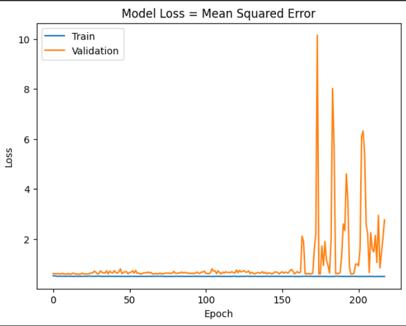

# Single Layer LSTM Classification 1

## Melhor modelo RandomSearch
    Trial 100 Complete 
    Best val_loss So Far: 0.6036646664142609
    Total elapsed time: 03h 35m 28s
    Objective(name="val_loss", direction="min")

    Trial 049 summary
    Hyperparameters:
    num_lstm_units: 32
    dropout_rate: 0.22547026421413913
    learning_rate: 0.07191048334401892
    Score: 0.6036646664142609

## Treinamento 
    Treinado por 500 épocas com EarlyStop com paciência de 100 épocas

## Métricas de Classificação

=============================
Target Class Threshold: 5
0     212
1    2854
2     236
Name: YClass, dtype: int64
Métricas para o THRESHOLD = 5
Métricas por classe:
Precisão: [0.         0.91679274 0.        ]
Recall: [0. 1. 0.]
F1-Score: [0.         0.95659037 0.        ]
AUC Médio: [0.5 0.5 0.5]

Média das métricas:
Acurácia: 0.9167927382753404
Precisão: 0.9167927382753404
Recall: 0.9167927382753404
F1-Score: 0.9167927382753404
AUC Médio: 0.9375945537065054

