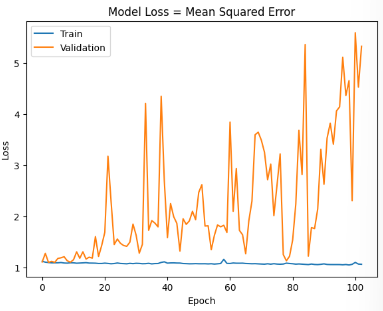
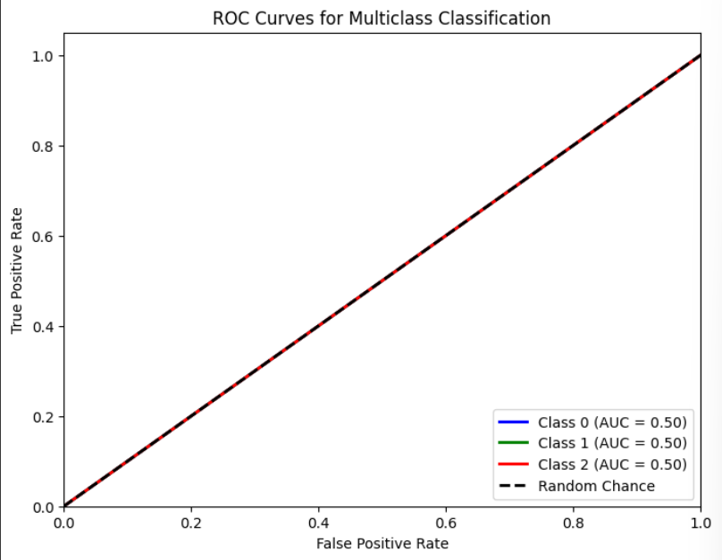

# Single Layer LSTM Classification 10

    df.Close.size: 3332
    target_df_Close.size: 3311
    target_df_Change.size: 3311
    target_df_Variation.size: 3311
    target_df_Class.size: 3311
    
    Target Class
    0     915
    1    1167
    2    1229
    Name: YClass, dtype: int64

    Tamanhos dos dados:
    size: 3311
    train_size: 2317
    validation_size: 331
    test_size: 663

    x_train_data.shape: (2331, 5)
    x_val_data.shape: (345, 5)
    x_test_data.shape: (677, 5)
    y_train_data.shape: (2317, 1)
    y_val_data.shape: (331, 1)
    y_test_data.shape: (663, 1)

    Formas dos DataFrames e arrays:
    df.shape: (3332, 5)
    x_train.shape: (2317, 15, 5), y_train.shape: (2317, 1)
    x_val.shape: (331, 15, 5), y_val.shape: (331, 1)
    x_test.shape: (663, 15, 5), y_test.shape: (663, 1)
## Melhor modelo RandomSearch

    Trial 100 Complete
    Best val_loss So Far: 1.0836066007614136
    Total elapsed time: 00h 23m 59s
    Objective(name="val_loss", direction="min")

    Trial 068 summary
    Hyperparameters:
    num_lstm_units: 128
    dropout_rate: 0.38047628130967315
    learning_rate: 0.04484875866260992
    Score: 1.0836066007614136

## Treinamento 
    Treinado por 500 épocas com EarlyStop com paciência de 100 épocas

## Métricas de Classificação
    
    ------------- Train -------------
    Métricas por classe:
    Precisão: [0.         0.         0.39577039]
    Recall: [0. 0. 1.]
    F1-Score: [0.         0.         0.56709957]
    AUC Médio: [0.5 0.5 0.5]

    Média das métricas:
    Acurácia: 0.3957703927492447
    Precisão: 0.3957703927492447
    Recall: 0.3957703927492447
    F1-Score: 0.39577039274924464
    AUC Médio: 0.5468277945619335

    ----------- Validation ----------
    Métricas por classe:
    Precisão: [0.         0.         0.38670695]
    Recall: [0. 0. 1.]
    F1-Score: [0.        0.        0.5577342]
    AUC Médio: [0.5 0.5 0.5]

    Média das métricas:
    Acurácia: 0.3867069486404834
    Precisão: 0.3867069486404834
    Recall: 0.3867069486404834
    F1-Score: 0.38670694864048333
    AUC Médio: 0.5400302114803625

    ------------- Test -------------
    Métricas por classe:
    Precisão: [0.        0.        0.2775264]
    Recall: [0. 0. 1.]
    F1-Score: [0.         0.         0.43447462]
    AUC Médio: [0.5 0.5 0.5]

    Média das métricas:
    Acurácia: 0.277526395173454
    Precisão: 0.277526395173454
    Recall: 0.277526395173454
    F1-Score: 0.277526395173454
    AUC Médio: 0.4581447963800904
