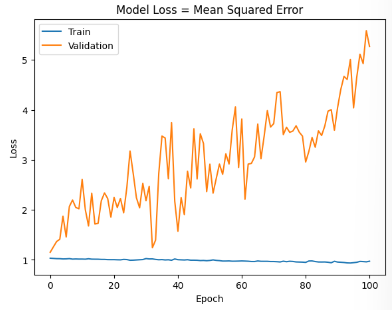
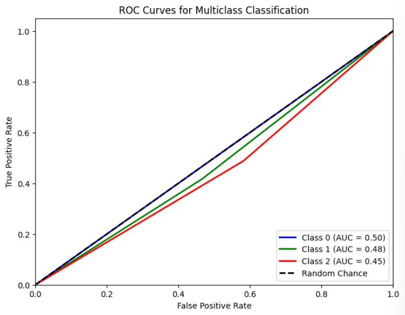

# Single Layer LSTM Classification 11
    df.Close.size: 3332
    target_df_Close.size: 3311
    target_df_Change.size: 3311
    target_df_Variation.size: 3311
    target_df_Class.size: 3311

    Target Class
    0     684
    1    1675
    2     952
    Name: YClass, dtype: int64

    Tamanhos dos dados:
    size: 3311
    train_size: 2317
    validation_size: 331
    test_size: 663

    x_train_data.shape: (2331, 5)
    x_val_data.shape: (345, 5)
    x_test_data.shape: (677, 5)
    y_train_data.shape: (2317, 1)
    y_val_data.shape: (331, 1)
    y_test_data.shape: (663, 1)

    Formas dos DataFrames e arrays:
    df.shape: (3332, 5)
    x_train.shape: (2317, 15, 5), y_train.shape: (2317, 1)
    x_val.shape: (331, 15, 5), y_val.shape: (331, 1)
    x_test.shape: (663, 15, 5), y_test.shape: (663, 1)
## Melhor modelo RandomSearch

    Trial 100 Complete
    Best val_loss So Far: 1.0772137641906738
    Total elapsed time: 00h 50m 18s
    Objective(name="val_loss", direction="min")

    Trial 063 summary
    Hyperparameters:
    num_lstm_units: 96
    dropout_rate: 0.2302979722528562
    learning_rate: 0.016225243811798365
    Score: 1.0772137641906738

## Treinamento 
    Treinado por 500 épocas com EarlyStop com paciência de 100 épocas

## Métricas de Classificação
    
    ------------- Train -------------
    Métricas por classe:
    Precisão: [0.         0.48854302 0.        ]
    Recall: [0. 1. 0.]
    F1-Score: [0.        0.6564043 0.       ]
    AUC Médio: [0.5        0.50168492 0.49874608]

    Média das métricas:
    Acurácia: 0.48769961156668107
    Precisão: 0.48769961156668107
    Recall: 0.48769961156668107
    F1-Score: 0.48769961156668107
    AUC Médio: 0.6157747086750107

    ----------- Validation ----------
    Métricas por classe:
    Precisão: [0.         0.4        0.31012658]
    Recall: [0.         0.04444444 0.93333333]
    F1-Score: [0.         0.08       0.46555819]
    AUC Médio: [0.5        0.49926304 0.48436578]

    Média das métricas:
    Acurácia: 0.31419939577039274
    Precisão: 0.31419939577039274
    Recall: 0.31419939577039274
    F1-Score: 0.31419939577039274
    AUC Médio: 0.4856495468277946

    ------------- Test -------------
    Métricas por classe:
    Precisão: [0.        0.5916955 0.1631016]
    Recall: [0.         0.41707317 0.488     ]
    F1-Score: [0.         0.48927039 0.24448898]
    AUC Médio: [0.5        0.475335   0.45310781]

    Média das métricas:
    Acurácia: 0.34992458521870284
    Precisão: 0.34992458521870284
    Recall: 0.34992458521870284
    F1-Score: 0.34992458521870284
    AUC Médio: 0.5124434389140272
    
