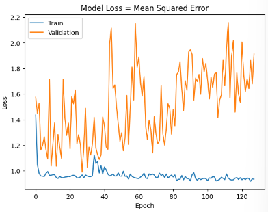

# Single Layer LSTM Classification 12

    df.Close.size: 3332
    target_df_Close.size: 3311
    target_df_Change.size: 3311
    target_df_Variation.size: 3311
    target_df_Class.size: 3311

    Target Class
    0     503
    1    2052
    2     756
    Name: YClass, dtype: int64

    Tamanhos dos dados:
    size: 3311
    train_size: 2317
    validation_size: 331
    test_size: 663

    x_train_data.shape: (2331, 5)
    x_val_data.shape: (345, 5)
    x_test_data.shape: (677, 5)
    y_train_data.shape: (2317, 1)
    y_val_data.shape: (331, 1)
    y_test_data.shape: (663, 1)

    Formas dos DataFrames e arrays:
    df.shape: (3332, 5)
    x_train.shape: (2317, 15, 5), y_train.shape: (2317, 1)
    x_val.shape: (331, 15, 5), y_val.shape: (331, 1)
    x_test.shape: (663, 15, 5), y_test.shape: (663, 1)

## Melhor modelo RandomSearch

    Trial 100 Complete
    Best val_loss So Far: 1.009371042251587
    Total elapsed time: 00h 52m 52s
    Objective(name="val_loss", direction="min")

    Trial 044 summary
    Hyperparameters:
    num_lstm_units: 64
    dropout_rate: 0.06110916841795344
    learning_rate: 0.06985347772888785
    Score: 1.009371042251587

## Treinamento 
    Treinado por 500 épocas com EarlyStop com paciência de 100 épocas

## Métricas de Classificação
    
    ------------- Train -------------
    Métricas por classe:
    Precisão: [0.         0.60658579 0.77777778]
    Recall: [0.         0.99928622 0.01215278]
    F1-Score: [0.         0.75492046 0.02393162]
    AUC Médio: [0.5        0.50400992 0.50550201]

    Média das métricas:
    Acurácia: 0.6072507552870091
    Precisão: 0.6072507552870091
    Recall: 0.6072507552870091
    F1-Score: 0.6072507552870091
    AUC Médio: 0.7054380664652568

    ----------- Validation ----------
    Métricas por classe:
    Precisão: [0.5        0.53250774 0.33333333]
    Recall: [0.01369863 0.97175141 0.02469136]
    F1-Score: [0.02666667 0.688      0.04597701]
    AUC Médio: [0.50491133 0.49561597 0.50434568]

    Média das métricas:
    Acurácia: 0.5287009063444109
    Precisão: 0.5287009063444109
    Recall: 0.5287009063444109
    F1-Score: 0.5287009063444109
    AUC Médio: 0.6465256797583081

    ------------- Test -------------
    Métricas por classe:
    Precisão: [0.         0.72665535 0.13513514]
    Recall: [0.         0.90295359 0.1010101 ]
    F1-Score: [0.         0.80526811 0.11560694]
    AUC Médio: [0.5        0.52555087 0.49376746]

    Média das métricas:
    Acurácia: 0.6606334841628959
    Precisão: 0.6606334841628959
    Recall: 0.6606334841628959
    F1-Score: 0.6606334841628959
    AUC Médio: 0.7454751131221719

    