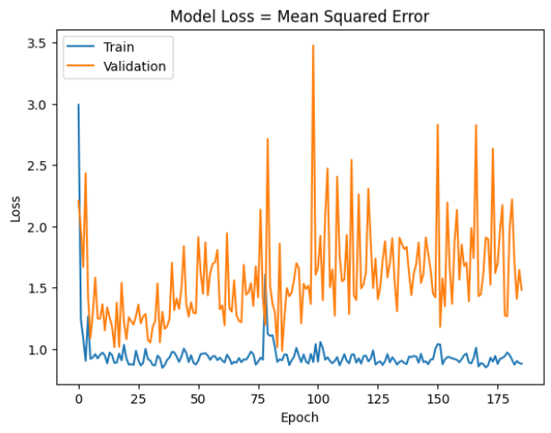
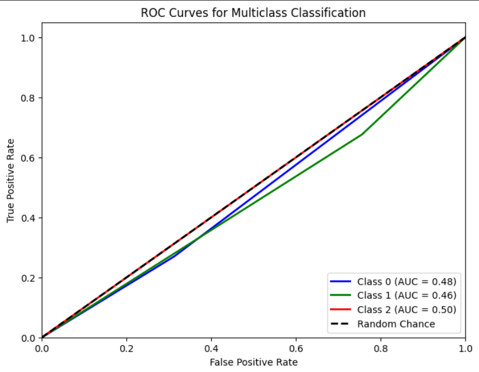

# Single Layer LSTM Classification 13

   df.Close.size: 3332
    target_df_Close.size: 3272
    target_df_Change.size: 3272
    target_df_Variation.size: 3272
    target_df_Class.size: 3272

    Target Class
    0     408
    1    2379
    2     485
    Name: YClass, dtype: int64

    Tamanhos dos dados:
    size: 3272
    train_size: 2290
    validation_size: 327
    test_size: 655

    x_train_data.shape: (2349, 5)
    x_val_data.shape: (386, 5)
    x_test_data.shape: (714, 5)
    y_train_data.shape: (2290, 1)
    y_val_data.shape: (327, 1)
    y_test_data.shape: (655, 1)

    Formas dos DataFrames e arrays:
    df.shape: (3332, 5)
    x_train.shape: (2290, 60, 5), y_train.shape: (2290, 1)
    x_val.shape: (327, 60, 5), y_val.shape: (327, 1)
    x_test.shape: (655, 60, 5), y_test.shape: (655, 1)

## Melhor Modelo Random Search

    Trial 100 Complete 
    Best val_loss So Far: 0.9094551801681519
    Total elapsed time: 02h 20m 42s
    Objective(name="val_loss", direction="min")

    Trial 085 summary
    Hyperparameters:
    num_lstm_units: 112
    dropout_rate: 0.2409233878119169
    learning_rate: 0.08976726357510435
    Score: 0.9094551801681519

## Treinamento 
    Treinado por 500 épocas com EarlyStop com paciência de 100 épocas

## Métricas de Classificação
    
    ------------- Train -------------
    Métricas por classe:
    Precisão: [0.2        0.72222222 0.        ]
    Recall: [0.02816901 0.98844282 0.        ]
    F1-Score: [0.04938272 0.83461736 0.        ]
    AUC Médio: [0.50610844 0.51047528 0.5       ]

    Média das métricas:
    Acurácia: 0.7131004366812227
    Precisão: 0.7131004366812227
    Recall: 0.7131004366812227
    F1-Score: 0.7131004366812227
    AUC Médio: 0.7848253275109169

    ----------- Validation ----------
    Métricas por classe:
    Precisão: [0.05882353 0.63548387 0.        ]
    Recall: [0.01639344 0.95169082 0.        ]
    F1-Score: [0.02564103 0.76208897 0.        ]
    AUC Médio: [0.47812153 0.50501208 0.5       ]

    Média das métricas:
    Acurácia: 0.6055045871559633
    Precisão: 0.6055045871559633
    Recall: 0.6055045871559633
    F1-Score: 0.6055045871559633
    AUC Médio: 0.7041284403669724
    
    ------------- Test -------------
    Métricas por classe:
    Precisão: [0.08415842 0.78807947 0.        ]
    Recall: [0.26984127 0.67613636 0.        ]
    F1-Score: [0.12830189 0.72782875 0.        ]
    AUC Médio: [0.47867063 0.46011543 0.5       ]

    Média das métricas:
    Acurácia: 0.5709923664122137
    Precisão: 0.5709923664122137
    Recall: 0.5709923664122137
    F1-Score: 0.5709923664122137
    AUC Médio: 0.6782442748091604

    