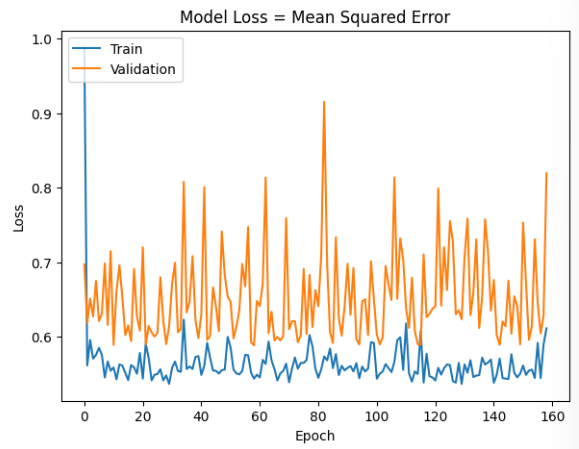
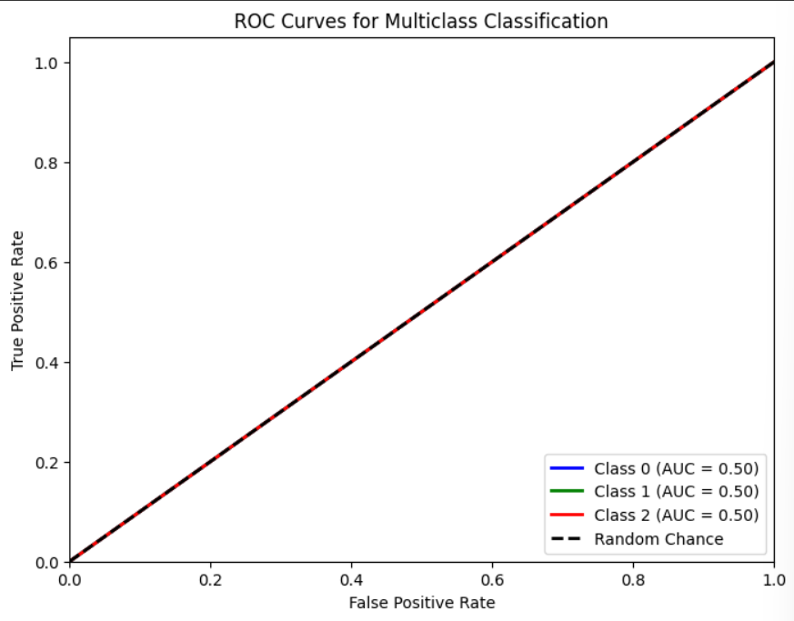

# Single Layer LSTM Classification 14

df.Close.size: 3332
target_df_Close.size: 3272
target_df_Change.size: 3272
target_df_Variation.size: 3272
target_df_Class.size: 3272

Target Class
0     208
1    2830
2     234
Name: YClass, dtype: int64

Tamanhos dos dados:
size: 3272
train_size: 2290
validation_size: 327
test_size: 655

x_train_data.shape: (2349, 5)
x_val_data.shape: (386, 5)
x_test_data.shape: (714, 5)
y_train_data.shape: (2290, 1)
y_val_data.shape: (327, 1)
y_test_data.shape: (655, 1)

Formas dos DataFrames e arrays:
df.shape: (3332, 5)
x_train.shape: (2290, 60, 5), y_train.shape: (2290, 1)
x_val.shape: (327, 60, 5), y_val.shape: (327, 1)
x_test.shape: (655, 60, 5), y_test.shape: (655, 1)

## Melhor Modelo Random Search
Trial 100 Complete 
Best val_loss So Far: 0.5916347503662109
Total elapsed time: 00h 24m 23s
Objective(name="val_loss", direction="min")

Trial 026 summary
Hyperparameters:
num_lstm_units: 112
dropout_rate: 0.23585279486773933
learning_rate: 0.09277389274310584
Score: 0.5916347503662109
## Treinamento 
    Treinado por 500 épocas com EarlyStop com paciência de 100 épocas

## Métricas de Classificação
    ------------- Train -------------
    Métricas por classe:
    Precisão: [0.         0.85633188 0.        ]
    Recall: [0. 1. 0.]
    F1-Score: [0.         0.92260645 0.        ]
    AUC Médio: [0.5 0.5 0.5]

    Média das métricas:
    Acurácia: 0.8563318777292577
    Precisão: 0.8563318777292577
    Recall: 0.8563318777292577
    F1-Score: 0.8563318777292577
    AUC Médio: 0.8922489082969433

    ----------- Validation ----------
    Métricas por classe:
    Precisão: [0.         0.82262997 0.        ]
    Recall: [0. 1. 0.]
    F1-Score: [0.         0.90268456 0.        ]
    AUC Médio: [0.5 0.5 0.5]

    Média das métricas:
    Acurácia: 0.8226299694189603
    Precisão: 0.8226299694189603
    Recall: 0.8226299694189603
    F1-Score: 0.8226299694189603
    AUC Médio: 0.8669724770642202

    ------------- Test -------------
    Métricas por classe:
    Precisão: [0.         0.91603053 0.        ]
    Recall: [0. 1. 0.]
    F1-Score: [0.        0.9561753 0.       ]
    AUC Médio: [0.5 0.5 0.5]

    Média das métricas:
    Acurácia: 0.916030534351145
    Precisão: 0.916030534351145
    Recall: 0.916030534351145
    F1-Score: 0.916030534351145
    AUC Médio: 0.9370229007633587

    