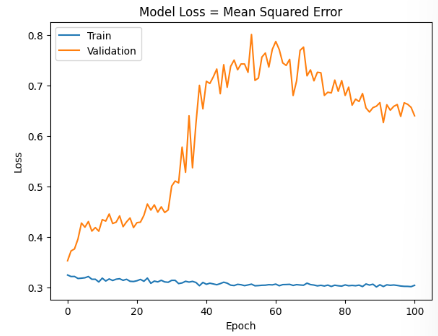
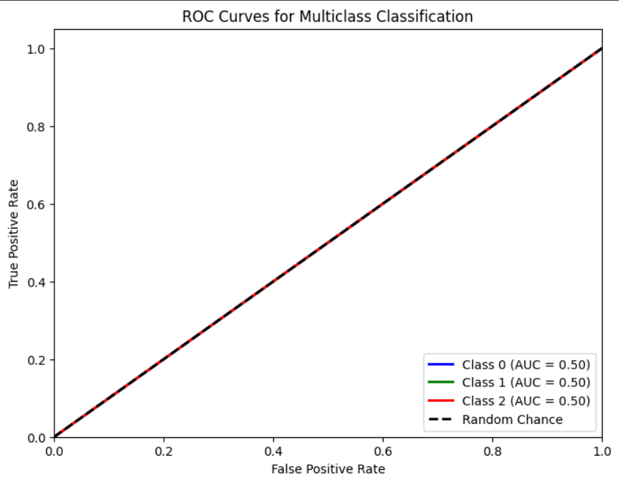

# Single Layer LSTM Classification 14
df.Close.size: 3332
target_df_Close.size: 3272
target_df_Change.size: 3272
target_df_Variation.size: 3272
target_df_Class.size: 3272

Target Class
0      98
1    3048
2     126
Name: YClass, dtype: int64

Tamanhos dos dados:
size: 3272
train_size: 2290
validation_size: 327
test_size: 655

x_train_data.shape: (2349, 5)
x_val_data.shape: (386, 5)
x_test_data.shape: (714, 5)
y_train_data.shape: (2290, 1)
y_val_data.shape: (327, 1)
y_test_data.shape: (655, 1)

Formas dos DataFrames e arrays:
df.shape: (3332, 5)
x_train.shape: (2290, 60, 5), y_train.shape: (2290, 1)
x_val.shape: (327, 60, 5), y_val.shape: (327, 1)
x_test.shape: (655, 60, 5), y_test.shape: (655, 1)

## Melhor Modelo Random Search

## Treinamento 
    Treinado por 500 épocas com EarlyStop com paciência de 100 épocas

## Métricas de Classificação
    

    