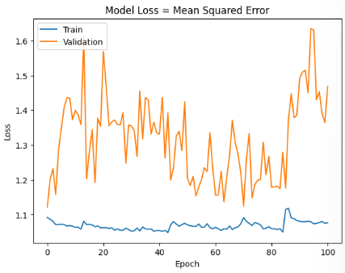
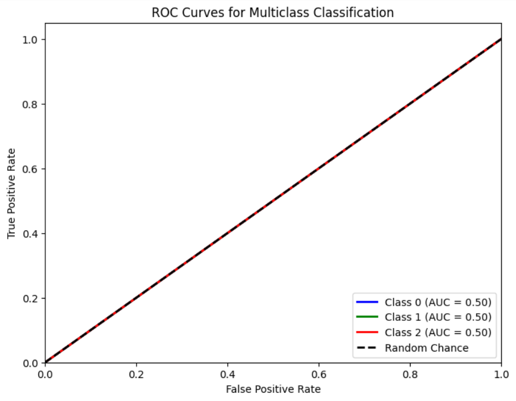

# Single Layer LSTM Classification 16
    df.Close.size: 3332
    target_df_Close.size: 3266
    target_df_Change.size: 3266
    target_df_Variation.size: 3266
    target_df_Class.size: 3266

    Target Class
    0     897
    1    1158
    2    1211
    Name: YClass, dtype: int64

    Tamanhos dos dados:
    size: 3266
    train_size: 2286
    validation_size: 326
    test_size: 654

    x_train_data.shape: (2345, 5)
    x_val_data.shape: (385, 5)
    x_test_data.shape: (713, 5)
    y_train_data.shape: (2286, 1)
    y_val_data.shape: (326, 1)
    y_test_data.shape: (654, 1)

    Formas dos DataFrames e arrays:
    df.shape: (3332, 5)
    x_train.shape: (2286, 60, 5), y_train.shape: (2286, 1)
    x_val.shape: (326, 60, 5), y_val.shape: (326, 1)
    x_test.shape: (654, 60, 5), y_test.shape: (654, 1)

## Melhor Modelo Random Search

    Trial 100 Complete
    Best val_loss So Far: 1.073695421218872
    Total elapsed time: 00h 32m 29s
    Objective(name="val_loss", direction="min")

    Trial 040 summary
    Hyperparameters:
    num_lstm_units: 32
    dropout_rate: 0.2537120689033916
    learning_rate: 0.012890987322014396
    Score: 1.073695421218872
## Treinamento 
    Treinado por 500 épocas com EarlyStop com paciência de 100 épocas

## Métricas de Classificação

    ------------- Train -------------
    Métricas por classe:
    Precisão: [0.         0.38291457 0.40898528]
    Recall: [0.         0.4916129  0.57894737]
    F1-Score: [0.         0.43050847 0.47934635]
    AUC Médio: [0.5        0.54262975 0.51181721]

    Média das métricas:
    Acurácia: 0.39763779527559057
    Precisão: 0.39763779527559057
    Recall: 0.39763779527559057
    F1-Score: 0.39763779527559057
    AUC Médio: 0.5482283464566929

    ----------- Validation ----------
    Métricas por classe:
    Precisão: [0.         0.         0.35889571]
    Recall: [0. 0. 1.]
    F1-Score: [0.        0.        0.5282167]
    AUC Médio: [0.5 0.5 0.5]

    Média das métricas:
    Acurácia: 0.3588957055214724
    Precisão: 0.3588957055214724
    Recall: 0.3588957055214724
    F1-Score: 0.3588957055214723
    AUC Médio: 0.5191717791411042

    ------------- Test -------------
    Métricas por classe:
    Precisão: [0.         0.         0.27828746]
    Recall: [0. 0. 1.]
    F1-Score: [0.        0.        0.4354067]
    AUC Médio: [0.5 0.5 0.5]

    Média das métricas:
    Acurácia: 0.2782874617737003
    Precisão: 0.2782874617737003
    Recall: 0.2782874617737003
    F1-Score: 0.2782874617737003
    AUC Médio: 0.45871559633027525
    

    