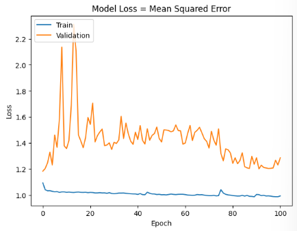
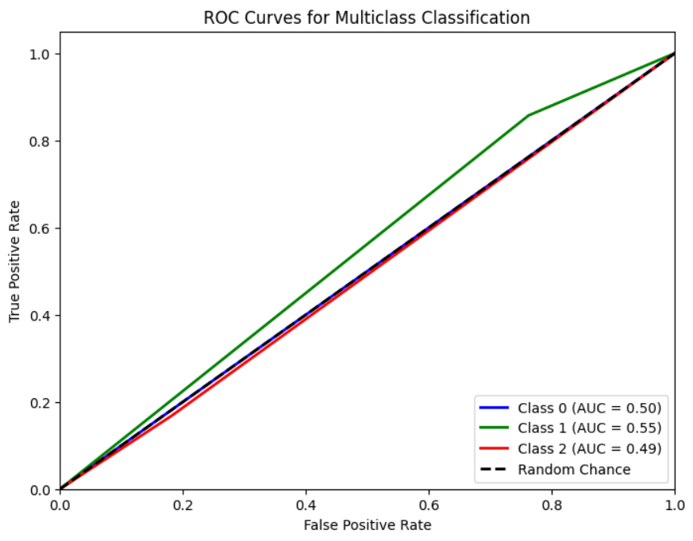

# Single Layer LSTM Classification 17

    df.Close.size: 3332
    target_df_Close.size: 3266
    target_df_Change.size: 3266
    target_df_Variation.size: 3266
    target_df_Class.size: 3266

    Target Class
    0     668
    1    1663
    2     935
    Name: YClass, dtype: int64

    Tamanhos dos dados:
    size: 3266
    train_size: 2286
    validation_size: 326
    test_size: 654

    x_train_data.shape: (2345, 5)
    x_val_data.shape: (385, 5)
    x_test_data.shape: (713, 5)
    y_train_data.shape: (2286, 1)
    y_val_data.shape: (326, 1)
    y_test_data.shape: (654, 1)

    Formas dos DataFrames e arrays:
    df.shape: (3332, 5)
    x_train.shape: (2286, 60, 5), y_train.shape: (2286, 1)
    x_val.shape: (326, 60, 5), y_val.shape: (326, 1)
    x_test.shape: (654, 60, 5), y_test.shape: (654, 1)
## Melhor Modelo Random Search

    Trial 100 Complete 
    Best val_loss So Far: 1.0750181674957275
    Total elapsed time: 01h 13m 07s
    Objective(name="val_loss", direction="min")

    Trial 026 summary
    Hyperparameters:
    num_lstm_units: 112
    dropout_rate: 0.15800648420903812
    learning_rate: 0.008181203226443353
    Score: 1.0750181674957275

## Treinamento 
    Treinado por 500 épocas com EarlyStop com paciência de 100 épocas

## Métricas de Classificação

    ------------- Train -------------
    Métricas por classe:
    Precisão: [0.         0.49842697 0.6557377 ]
    Recall: [0.         0.99017857 0.05578801]
    F1-Score: [0.         0.66307922 0.10282776]
    AUC Médio: [0.5        0.51653011 0.52120184]

    Média das métricas:
    Acurácia: 0.5026246719160105
    Precisão: 0.5026246719160105
    Recall: 0.5026246719160105
    F1-Score: 0.5026246719160105
    AUC Médio: 0.6269685039370079

    ----------- Validation ----------
    Métricas por classe:
    Precisão: [0.         0.42367601 0.        ]
    Recall: [0.         0.99270073 0.        ]
    F1-Score: [0.         0.59388646 0.        ]
    AUC Médio: [0.5        0.50693238 0.48927039]

    Média das métricas:
    Acurácia: 0.4171779141104294
    Precisão: 0.4171779141104294
    Recall: 0.4171779141104294
    F1-Score: 0.4171779141104294
    AUC Médio: 0.5628834355828221

    ------------- Test -------------
    Métricas por classe:
    Precisão: [0.         0.64804469 0.17948718]
    Recall: [0.         0.85714286 0.168     ]
    F1-Score: [0.         0.73806999 0.17355372]
    AUC Médio: [0.5        0.54752304 0.49326276]

    Média das métricas:
    Acurácia: 0.5642201834862385
    Precisão: 0.5642201834862385
    Recall: 0.5642201834862385
    F1-Score: 0.5642201834862385
    AUC Médio: 0.6731651376146789

    