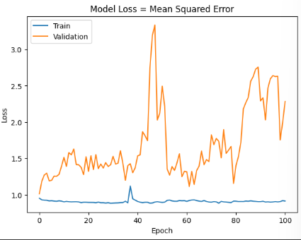
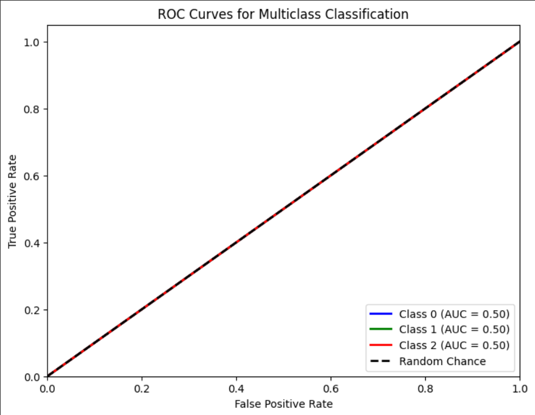

# Single Layer LSTM Classification 18
    df.Close.size: 3332
    target_df_Close.size: 3266
    target_df_Change.size: 3266
    target_df_Variation.size: 3266
    target_df_Class.size: 3266

    Target Class
    0     491
    1    2032
    2     743
    Name: YClass, dtype: int64

    Tamanhos dos dados:
    size: 3266
    train_size: 2286
    validation_size: 326
    test_size: 654

    x_train_data.shape: (2345, 5)
    x_val_data.shape: (385, 5)
    x_test_data.shape: (713, 5)
    y_train_data.shape: (2286, 1)
    y_val_data.shape: (326, 1)
    y_test_data.shape: (654, 1)

    Formas dos DataFrames e arrays:
    df.shape: (3332, 5)
    x_train.shape: (2286, 60, 5), y_train.shape: (2286, 1)
    x_val.shape: (326, 60, 5), y_val.shape: (326, 1)
    x_test.shape: (654, 60, 5), y_test.shape: (654, 1)

## Melhor Modelo Random Search

    Trial 100 Complete
    Best val_loss So Far: 1.0033584833145142
    Total elapsed time: 01h 09m 06s
    Objective(name="val_loss", direction="min")

    Trial 077 summary
    Hyperparameters:
    num_lstm_units: 112
    dropout_rate: 0.3605403300232217
    learning_rate: 0.01655798350852337
    Score: 1.0033584833145142

## Treinamento 
    Treinado por 500 épocas com EarlyStop com paciência de 100 épocas

## Métricas de Classificação

    ------------- Train -------------
    Métricas por classe:
    Precisão: [0.         0.60542432 0.        ]
    Recall: [0. 1. 0.]
    F1-Score: [0.         0.75422343 0.        ]
    AUC Médio: [0.5 0.5 0.5]

    Média das métricas:
    Acurácia: 0.605424321959755
    Precisão: 0.605424321959755
    Recall: 0.605424321959755
    F1-Score: 0.605424321959755
    AUC Médio: 0.7040682414698163

    ----------- Validation ----------
    Métricas por classe:
    Precisão: [0.         0.54907975 0.        ]
    Recall: [0. 1. 0.]
    F1-Score: [0.         0.70891089 0.        ]
    AUC Médio: [0.5 0.5 0.5]

    Média das métricas:
    Acurácia: 0.549079754601227
    Precisão: 0.549079754601227
    Recall: 0.549079754601227
    F1-Score: 0.549079754601227
    AUC Médio: 0.6618098159509204

    ------------- Test -------------
    Métricas por classe:
    Precisão: [0.         0.71712538 0.        ]
    Recall: [0. 1. 0.]
    F1-Score: [0.         0.83526269 0.        ]
    AUC Médio: [0.5 0.5 0.5]

    Média das métricas:
    Acurácia: 0.7171253822629969
    Precisão: 0.7171253822629969
    Recall: 0.7171253822629969
    F1-Score: 0.7171253822629969
    AUC Médio: 0.7878440366972478

    