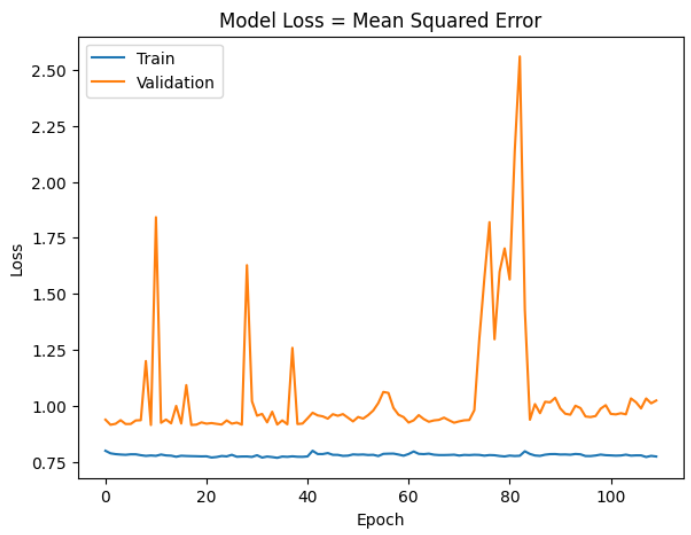
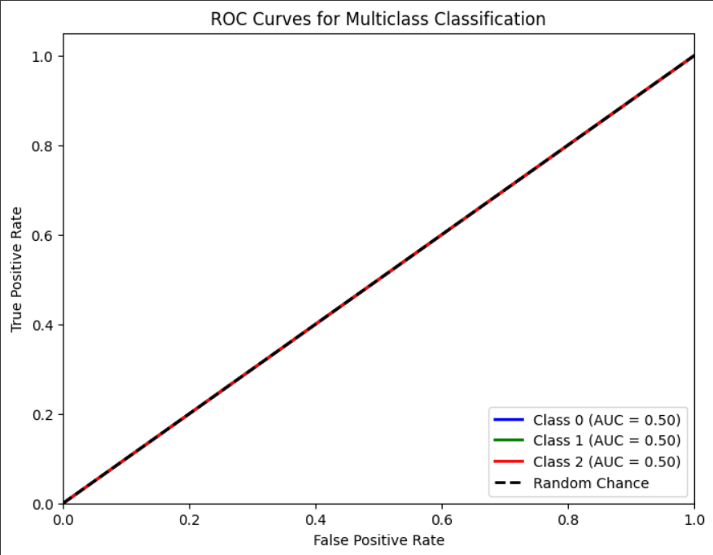

# Single Layer LSTM Classification 2

    df.Close.size: 3332
    target_df_Close.size: 3302
    target_df_Change.size: 3302
    target_df_Variation.size: 3302
    target_df_Class.size: 3302

    Target Class
    0     414
    1    2401
    2     487
    Name: YClass, dtype: int64

    Tamanhos dos dados:
    size: 3302
    train_size: 2311
    validation_size: 330
    test_size: 661

    x_train_data.shape: (2340, 5)
    x_val_data.shape: (359, 5)
    x_test_data.shape: (690, 5)
    y_train_data.shape: (2311, 1)
    y_val_data.shape: (330, 1)
    y_test_data.shape: (661, 1)

    Formas dos DataFrames e arrays:
    df.shape: (3332, 5)
    x_train.shape: (2311, 30, 5), y_train.shape: (2311, 1)
    x_val.shape: (330, 30, 5), y_val.shape: (330, 1)
    x_test.shape: (661, 30, 5), y_test.shape: (661, 1)
## Melhor modelo RandomSearch

    Trial 100 Complete 
    Best val_loss So Far: 0.9089738726615906
    Total elapsed time: 02h 39m 08s
    Objective(name="val_loss", direction="min")

    Trial 048 summary
    Hyperparameters:
    num_lstm_units: 16
    dropout_rate: 0.2884877011291786
    learning_rate: 0.047733071582848056
    Score: 0.9089738726615906

## Treinamento 
    Treinado por 500 épocas com EarlyStop com paciência de 100 épocas

## Métricas de Classificação
    Target Class Threshold: 3
    ------------- Train -------------
    Métricas por classe:
    Precisão: [0.         0.71830376 0.        ]
    Recall: [0. 1. 0.]
    F1-Score: [0.         0.83606145 0.        ]
    AUC Médio: [0.5 0.5 0.5]

    Média das métricas:
    Acurácia: 0.7183037646040675
    Precisão: 0.7183037646040675
    Recall: 0.7183037646040675
    F1-Score: 0.7183037646040674
    AUC Médio: 0.7887278234530506

    ----------- Validation ----------
    Métricas por classe:
    Precisão: [0.         0.63030303 0.        ]
    Recall: [0. 1. 0.]
    F1-Score: [0.        0.7732342 0.       ]
    AUC Médio: [0.5 0.5 0.5]

    Média das métricas:
    Acurácia: 0.6303030303030303
    Precisão: 0.6303030303030303
    Recall: 0.6303030303030303
    F1-Score: 0.6303030303030303
    AUC Médio: 0.7227272727272728

=============================
    ------------- Test -------------
    Target Class Threshold: 3
    Métricas por classe:
    Precisão: [0.         0.80635401 0.        ]
    Recall: [0. 1. 0.]
    F1-Score: [0.         0.89279732 0.        ]
    AUC Médio: [0.5 0.5 0.5]

    Média das métricas:
    Acurácia: 0.8063540090771558
    Precisão: 0.8063540090771558
    Recall: 0.8063540090771558
    F1-Score: 0.8063540090771558
    AUC Médio: 0.8547655068078668

