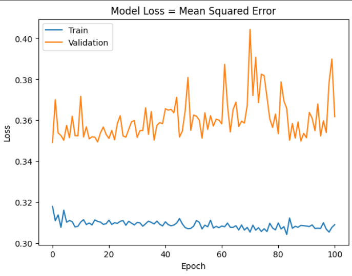
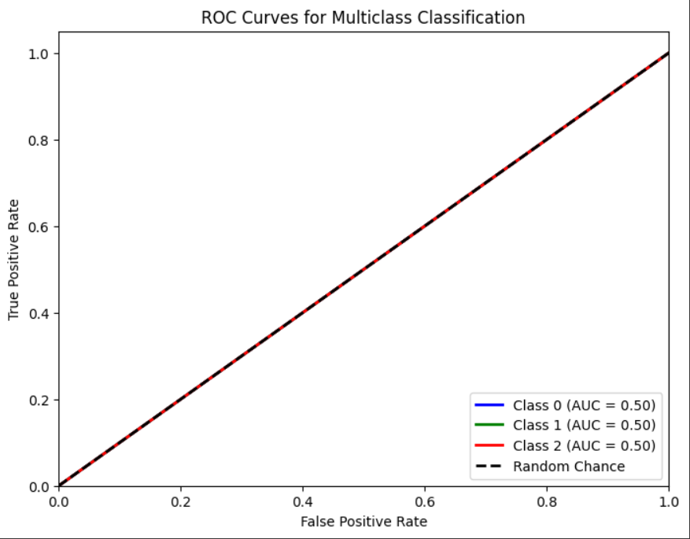

# Single Layer LSTM Classification 3

    df.Close.size: 3332
    target_df_Close.size: 3302
    target_df_Change.size: 3302
    target_df_Variation.size: 3302
    target_df_Class.size: 3302  

    Target Class
    0      98
    1    3077
    2     127
    Name: YClass, dtype: int64

    Tamanhos dos dados:
    size: 3302
    train_size: 2311
    validation_size: 330
    test_size: 661

    x_train_data.shape: (2340, 5)
    x_val_data.shape: (359, 5)
    x_test_data.shape: (690, 5)
    y_train_data.shape: (2311, 1)
    y_val_data.shape: (330, 1)
    y_test_data.shape: (661, 1)

    Formas dos DataFrames e arrays:
    df.shape: (3332, 5)
    x_train.shape: (2311, 30, 5), y_train.shape: (2311, 1)
    x_val.shape: (330, 30, 5), y_val.shape: (330, 1)
    x_test.shape: (661, 30, 5), y_test.shape: (661, 1)

## Melhor modelo RandomSearch

    Trial 100 Complete 
    Best val_loss So Far: 0.3482067137956619
    Total elapsed time: 00h 48m 37s
    Objective(name="val_loss", direction="min")

    Trial 056 summary
    Hyperparameters:
    num_lstm_units: 16
    dropout_rate: 0.1255617357310185
    learning_rate: 0.06224617893249794
    Score: 0.3482067137956619

## Treinamento 
    Treinado por 500 épocas com EarlyStop com paciência de 100 épocas

## Métricas de Classificação
    ----- Métricas de Classificação -----
    ------------- Train -------------
    Métricas por classe:
    Precisão: [0.         0.92687148 0.        ]
    Recall: [0. 1. 0.]
    F1-Score: [0.         0.96204806 0.        ]
    AUC Médio: [0.5 0.5 0.5]

    Média das métricas:
    Acurácia: 0.9268714842059714
    Precisão: 0.9268714842059714
    Recall: 0.9268714842059714
    F1-Score: 0.9268714842059714
    AUC Médio: 0.9451536131544787

    ----------- Validation ----------
    Métricas por classe:
    Precisão: [0.         0.91515152 0.        ]
    Recall: [0. 1. 0.]
    F1-Score: [0.        0.9556962 0.       ]
    AUC Médio: [0.5 0.5 0.5]

    Média das métricas:
    Acurácia: 0.9151515151515152
    Precisão: 0.9151515151515152
    Recall: 0.9151515151515152
    F1-Score: 0.915151515151515
    AUC Médio: 0.9363636363636363

    ------------- Test -------------
    Métricas por classe:
    Precisão: [0.         0.95763994 0.        ]
    Recall: [0. 1. 0.]
    F1-Score: [0.         0.97836167 0.        ]
    AUC Médio: [0.5 0.5 0.5]

    Média das métricas:
    Acurácia: 0.9576399394856279
    Precisão: 0.9576399394856279
    Recall: 0.9576399394856279
    F1-Score: 0.9576399394856279
    AUC Médio: 0.9682299546142209

