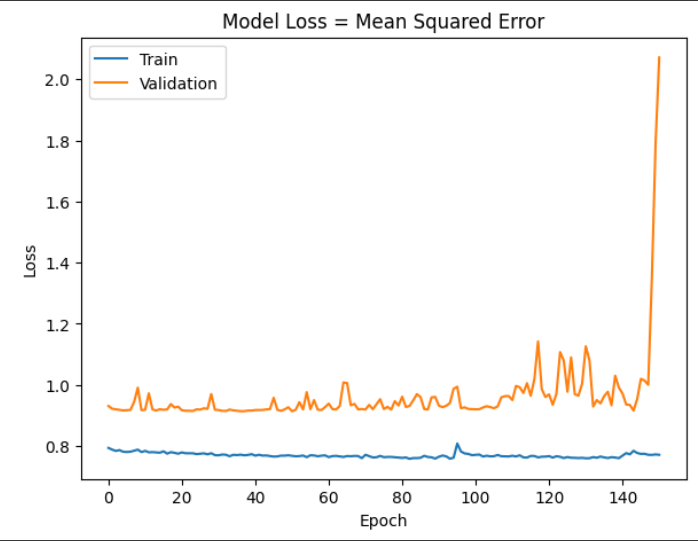
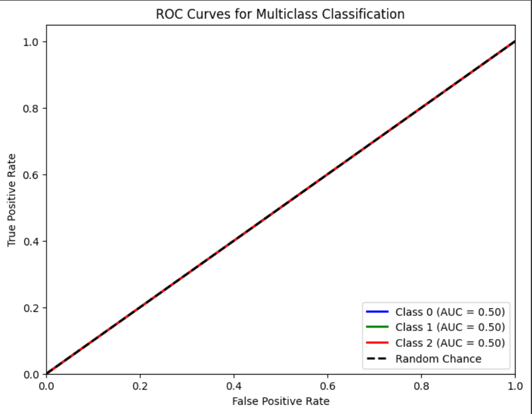

# Single Layer LSTM Classification 3

    df.Close.size: 3332
    target_df_Close.size: 3317
    target_df_Change.size: 3317
    target_df_Variation.size: 3317
    target_df_Class.size: 3317

    Target Class
    0     417
    1    2409
    2     491
    Name: YClass, dtype: int64

    Tamanhos dos dados:
    size: 3317
    train_size: 2321
    validation_size: 331
    test_size: 665

    x_train_data.shape: (2335, 5)
    x_val_data.shape: (345, 5)
    x_test_data.shape: (679, 5)
    y_train_data.shape: (2321, 1)
    y_val_data.shape: (331, 1)
    y_test_data.shape: (665, 1)

    Formas dos DataFrames e arrays:
    df.shape: (3332, 5)
    x_train.shape: (2321, 15, 5), y_train.shape: (2321, 1)
    x_val.shape: (331, 15, 5), y_val.shape: (331, 1)
    x_test.shape: (665, 15, 5), y_test.shape: (665, 1)

## Melhor modelo RandomSearch
    Trial 100 Complete 
    Best val_loss So Far: 0.9155804216861725
    Total elapsed time: 01h 45m 04s

    Objective(name="val_loss", direction="min")

    Trial 034 summary
    Hyperparameters:
    num_lstm_units: 32
    dropout_rate: 0.3363655937516343
    learning_rate: 0.03373201432675782
    Score: 0.9155804216861725

## Treinamento 
    Treinado por 500 épocas com EarlyStop com paciência de 100 épocas

## Métricas de Classificação

    ----- Métricas de Classificação -----
    ------------- Train -------------
    Métricas por classe:
    Precisão: [0.         0.71779405 0.        ]
    Recall: [0. 1. 0.]
    F1-Score: [0.         0.83571608 0.        ]
    AUC Médio: [0.5 0.5 0.5]

    Média das métricas:
    Acurácia: 0.7177940542869453
    Precisão: 0.7177940542869453
    Recall: 0.7177940542869453
    F1-Score: 0.7177940542869454
    AUC Médio: 0.7883455407152089

    ----------- Validation ----------
    Métricas por classe:
    Precisão: [0.         0.62839879 0.        ]
    Recall: [0. 1. 0.]
    F1-Score: [0.         0.77179963 0.        ]
    AUC Médio: [0.5 0.5 0.5]

    Média das métricas:
    Acurácia: 0.6283987915407855
    Precisão: 0.6283987915407855
    Recall: 0.6283987915407855
    F1-Score: 0.6283987915407855
    AUC Médio: 0.7212990936555892

    ------------- Test -------------
    Métricas por classe:
    Precisão: [0.         0.80451128 0.        ]
    Recall: [0. 1. 0.]
    F1-Score: [0.         0.89166667 0.        ]
    AUC Médio: [0.5 0.5 0.5]

    Média das métricas:
    Acurácia: 0.8045112781954887
    Precisão: 0.8045112781954887
    Recall: 0.8045112781954887
    F1-Score: 0.8045112781954887
    AUC Médio: 0.8533834586466165
    
