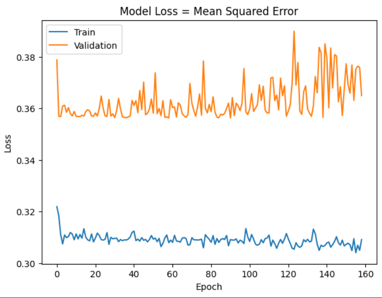
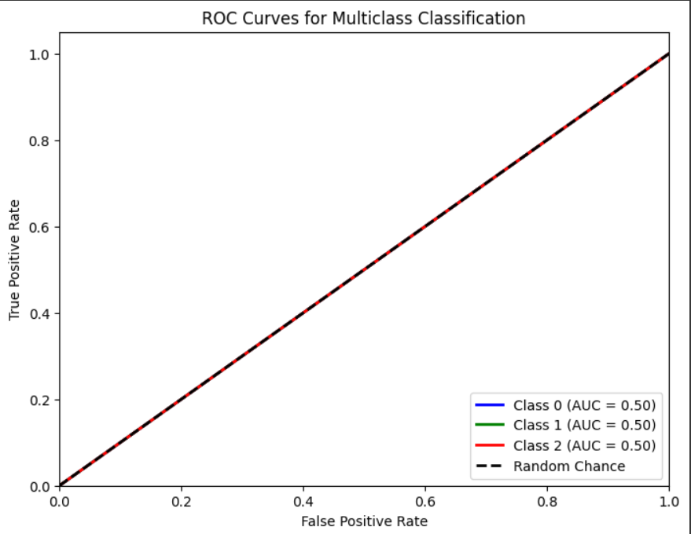

# Single Layer LSTM Classification 6

    df.Close.size: 3332
    target_df_Close.size: 3317
    target_df_Change.size: 3317
    target_df_Variation.size: 3317
    target_df_Class.size: 3317

    Target Class
    0      99
    1    3091
    2     127
    Name: YClass, dtype: int64

    Tamanhos dos dados:
    size: 3317
    train_size: 2321
    validation_size: 331
    test_size: 665

    x_train_data.shape: (2335, 5)
    x_val_data.shape: (345, 5)
    x_test_data.shape: (679, 5)
    y_train_data.shape: (2321, 1)
    y_val_data.shape: (331, 1)
    y_test_data.shape: (665, 1)

    Formas dos DataFrames e arrays:
    df.shape: (3332, 5)
    x_train.shape: (2321, 15, 5), y_train.shape: (2321, 1)
    x_val.shape: (331, 15, 5), y_val.shape: (331, 1)
    x_test.shape: (665, 15, 5), y_test.shape: (665, 1)

## Melhor modelo RandomSearch

    Trial 100 Complete
    Best val_loss So Far: 0.3572828024625778
    Total elapsed time: 01h 28m 31s
    Objective(name="val_loss", direction="min")

    Trial 030 summary
    Hyperparameters:
    num_lstm_units: 16
    dropout_rate: 0.16830377128690507
    learning_rate: 0.07964892979213052
    Score: 0.3572828024625778

## Treinamento 
    Treinado por 500 épocas com EarlyStop com paciência de 100 épocas

## Métricas de Classificação

    ------------- Train -------------
    Métricas por classe:
    Precisão: [0.         0.92718656 0.        ]
    Recall: [0. 1. 0.]
    F1-Score: [0.         0.96221775 0.        ]
    AUC Médio: [0.5 0.5 0.5]

    Média das métricas:
    Acurácia: 0.927186557518311
    Precisão: 0.927186557518311
    Recall: 0.927186557518311
    F1-Score: 0.927186557518311
    AUC Médio: 0.9453899181387333

    ----------- Validation ----------
    Métricas por classe:
    Precisão: [0.         0.91238671 0.        ]
    Recall: [0. 1. 0.]
    F1-Score: [0.         0.95418641 0.        ]
    AUC Médio: [0.5 0.5 0.5]

    Média das métricas:
    Acurácia: 0.9123867069486404
    Precisão: 0.9123867069486404
    Recall: 0.9123867069486404
    F1-Score: 0.9123867069486404
    AUC Médio: 0.9342900302114804

    ------------- Test -------------
    Métricas por classe:
    Precisão: [0.         0.95789474 0.        ]
    Recall: [0. 1. 0.]
    F1-Score: [0.         0.97849462 0.        ]
    AUC Médio: [0.5 0.5 0.5]

    Média das métricas:
    Acurácia: 0.9578947368421052
    Precisão: 0.9578947368421052
    Recall: 0.9578947368421052
    F1-Score: 0.9578947368421052
    AUC Médio: 0.9684210526315788

