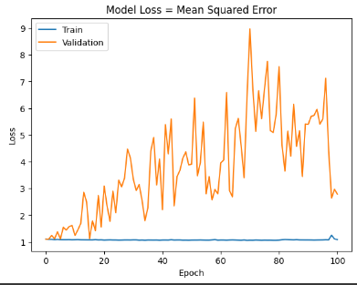

# Single Layer LSTM Classification 7
df.Close.size: 3332
target_df_Close.size: 3296
target_df_Change.size: 3296
target_df_Variation.size: 3296
target_df_Class.size: 3296

Target Class
0     913
1    1162
2    1221
Name: YClass, dtype: int64

Tamanhos dos dados:
size: 3296
train_size: 2307
validation_size: 329
test_size: 660

x_train_data.shape: (2336, 5)
x_val_data.shape: (358, 5)
x_test_data.shape: (689, 5)
y_train_data.shape: (2307, 1)
y_val_data.shape: (329, 1)
y_test_data.shape: (660, 1)

Formas dos DataFrames e arrays:
df.shape: (3332, 5)
x_train.shape: (2307, 30, 5), y_train.shape: (2307, 1)
x_val.shape: (329, 30, 5), y_val.shape: (329, 1)
x_test.shape: (660, 30, 5), y_test.shape: (660, 1)
## Melhor modelo RandomSearch

## Treinamento 
    Treinado por 500 épocas com EarlyStop com paciência de 100 épocas

## Métricas de Classificação

