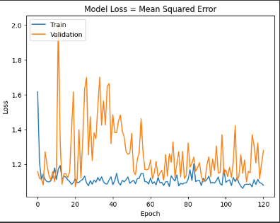
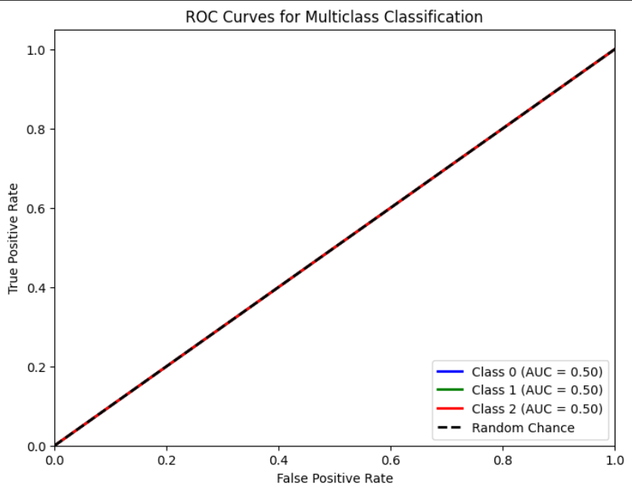

# Single Layer LSTM Classification 8
    
    df.Close.size: 3332
    target_df_Close.size: 3296
    target_df_Change.size: 3296
    target_df_Variation.size: 3296
    target_df_Class.size: 3296

    Target Class
    0     683
    1    1668
    2     945
    Name: YClass, dtype: int64

    Tamanhos dos dados:
    size: 3296
    train_size: 2307
    validation_size: 329
    test_size: 660

    x_train_data.shape: (2336, 5)
    x_val_data.shape: (358, 5)
    x_test_data.shape: (689, 5)
    y_train_data.shape: (2307, 1)
    y_val_data.shape: (329, 1)
    y_test_data.shape: (660, 1)

    Formas dos DataFrames e arrays:
    df.shape: (3332, 5)
    x_train.shape: (2307, 30, 5), y_train.shape: (2307, 1)
    x_val.shape: (329, 30, 5), y_val.shape: (329, 1)
    x_test.shape: (660, 30, 5), y_test.shape: (660, 1)

## Melhor modelo RandomSearch

    Trial 100 Complete
    Best val_loss So Far: 1.0700639486312866
    Total elapsed time: 00h 46m 17s
    Objective(name="val_loss", direction="min")

    Trial 041 summary
    Hyperparameters:
    num_lstm_units: 128
    dropout_rate: 0.3284324137052881
    learning_rate: 0.07047684831067186
    Score: 1.0700639486312866

## Treinamento 
    Treinado por 500 épocas com EarlyStop com paciência de 100 épocas

## Métricas de Classificação
    ------------- Train -------------
    Métricas por classe:
    Precisão: [0.         0.48677937 0.        ]
    Recall: [0. 1. 0.]
    F1-Score: [0.        0.6548105 0.       ]
    AUC Médio: [0.5 0.5 0.5]

    Média das métricas:
    Acurácia: 0.48677936714347636
    Precisão: 0.48677936714347636
    Recall: 0.48677936714347636
    F1-Score: 0.48677936714347636
    AUC Médio: 0.6150845253576073

    ----------- Validation ----------
    Métricas por classe:
    Precisão: [0.54347826 0.40636042 0.        ]
    Recall: [0.26595745 0.85185185 0.        ]
    F1-Score: [0.35714286 0.55023923 0.        ]
    AUC Médio: [0.58829787 0.49293624 0.5       ]

    Média das métricas:
    Acurácia: 0.425531914893617
    Precisão: 0.425531914893617
    Recall: 0.425531914893617
    F1-Score: 0.42553191489361697
    AUC Médio: 0.5691489361702128

    ------------- Test -------------
    Métricas por classe:
    Precisão: [0.         0.62121212 0.        ]
    Recall: [0. 1. 0.]
    F1-Score: [0.         0.76635514 0.        ]
    AUC Médio: [0.5 0.5 0.5]

    Média das métricas:
    Acurácia: 0.6212121212121212
    Precisão: 0.6212121212121212
    Recall: 0.6212121212121212
    F1-Score: 0.6212121212121212
    AUC Médio: 0.7159090909090908

