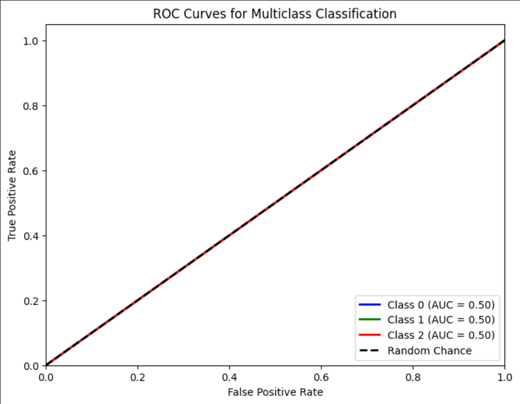

# Single Layer LSTM Classification 9

    df.Close.size: 3332
    target_df_Close.size: 3296
    target_df_Change.size: 3296
    target_df_Variation.size: 3296
    target_df_Class.size: 3296

    Target Class
    0     502
    1    2044
    2     750
    Name: YClass, dtype: int64

    Tamanhos dos dados:
    size: 3296
    train_size: 2307
    validation_size: 329
    test_size: 660

    x_train_data.shape: (2336, 5)
    x_val_data.shape: (358, 5)
    x_test_data.shape: (689, 5)
    y_train_data.shape: (2307, 1)
    y_val_data.shape: (329, 1)
    y_test_data.shape: (660, 1)

    Formas dos DataFrames e arrays:
    df.shape: (3332, 5)
    x_train.shape: (2307, 30, 5), y_train.shape: (2307, 1)
    x_val.shape: (329, 30, 5), y_val.shape: (329, 1)
    x_test.shape: (660, 30, 5), y_test.shape: (660, 1)
    
## Melhor modelo RandomSearch
    Trial 100 Complete 
    Best val_loss So Far: 1.0105313062667847
    Total elapsed time: 00h 24m 41s

    Trial 043 summary
    Hyperparameters:
    num_lstm_units: 112
    dropout_rate: 0.13379168315886134
    learning_rate: 0.024685399845732734
    Score: 1.0105313062667847

## Treinamento 
    Treinado por 500 épocas com EarlyStop com paciência de 100 épocas
    

## Métricas de Classificação
    ------------- Train -------------
    Métricas por classe:
    Precisão: [0.         0.60381448 0.        ]
    Recall: [0. 1. 0.]
    F1-Score: [0.         0.75297297 0.        ]
    AUC Médio: [0.5 0.5 0.5]

    Média das métricas:
    Acurácia: 0.6038144776766363
    Precisão: 0.6038144776766363
    Recall: 0.6038144776766363
    F1-Score: 0.6038144776766363
    AUC Médio: 0.7028608582574772

    ----------- Validation ----------
    Métricas por classe:
    Precisão: [0.         0.53799392 0.        ]
    Recall: [0. 1. 0.]
    F1-Score: [0.         0.69960474 0.        ]
    AUC Médio: [0.5 0.5 0.5]

    Média das métricas:
    Acurácia: 0.5379939209726444
    Precisão: 0.5379939209726444
    Recall: 0.5379939209726444
    F1-Score: 0.5379939209726444
    AUC Médio: 0.6534954407294833

    ------------- Test -------------
    Métricas por classe:
    Precisão: [0.         0.71818182 0.        ]
    Recall: [0. 1. 0.]
    F1-Score: [0.         0.83597884 0.        ]
    AUC Médio: [0.5 0.5 0.5]

    Média das métricas:
    Acurácia: 0.7181818181818181
    Precisão: 0.7181818181818181
    Recall: 0.7181818181818181
    F1-Score: 0.7181818181818181
    AUC Médio: 0.7886363636363637

