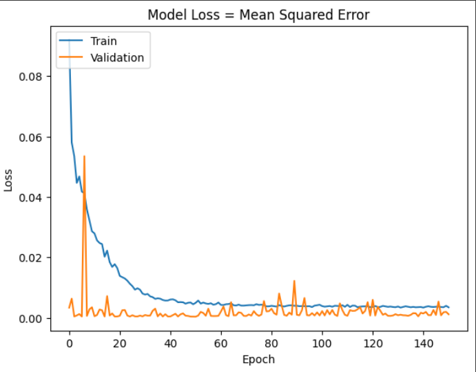
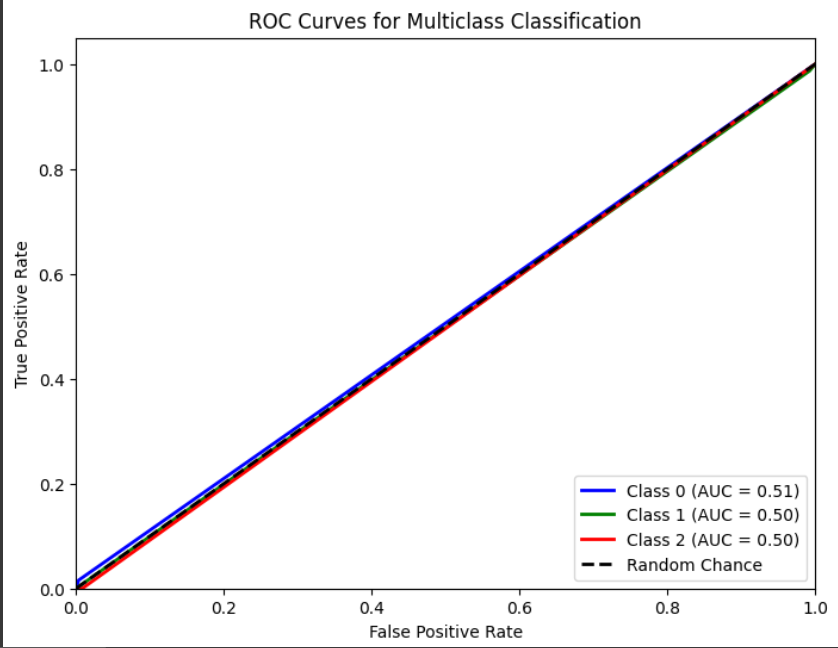
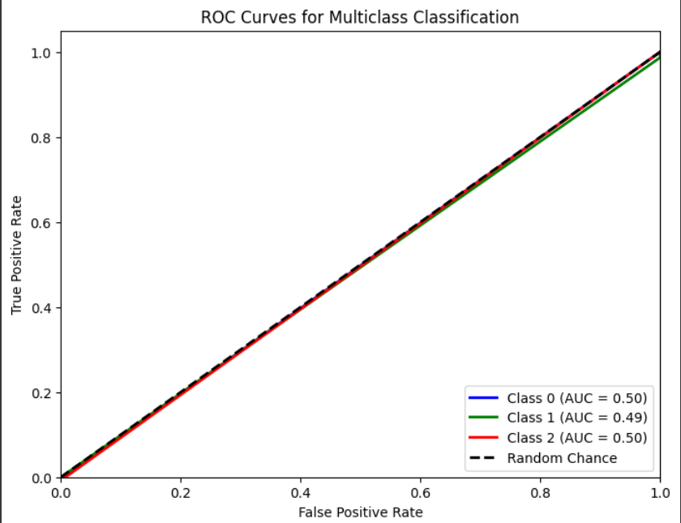
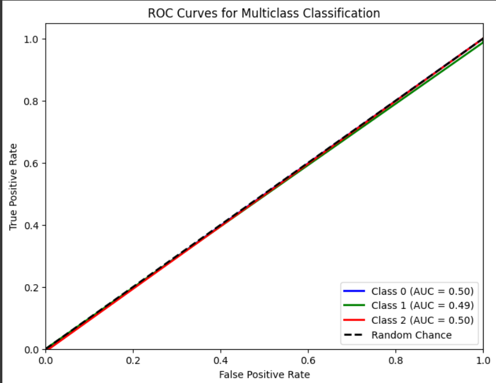

# Single Layer LSTM Regression 1

## Variáveis no modelo 

    df.Close.size: 3332
    target_df_Close.size: 3302
    target_df_Change.size: 3302
    target_df_Variation.size: 3302

    Tamanhos dos dados:
    size: 3302
    train_size: 2311
    validation_size: 330
    test_size: 661

    x_train_data.shape: (2340, 5)
    x_val_data.shape: (359, 5)
    x_test_data.shape: (690, 5)
    y_train_data.shape: (2311, 1)
    y_val_data.shape: (330, 1)
    y_test_data.shape: (661, 1)

    Formas dos DataFrames e arrays:
    df.shape: (3332, 5)
    x_train.shape: (2311, 30, 5), y_train.shape: (2311, 1)
    x_val.shape: (330, 30, 5), y_val.shape: (330, 1)
    x_test.shape: (661, 30, 5), y_test.shape: (661, 1)
## Melhor modelo RandomSearch
    Trial 100 Complete
    Best val_loss So Far: 0.00047773809637874365
    Total elapsed time: 01h 23m 19s
    Objective(name="val_loss", direction="min")

    Trial 022 summary
    Hyperparameters:
    num_lstm_units: 16
    dropout_rate: 0.0910764285747253
    learning_rate: 0.004050846751003185
    activation: tanh
    Score: 0.00047773809637874365

## Treinamento 
    Treinado por 500 épocas com EarlyStop com paciência de 100 épocas

## Métricas de Regressão

    ------------- Train -------------
    MAE: 0.040741242327990396
    MSE: 0.003654714971519063
    RMSE: 0.06045423865635116
    MAPE: 1.4842865211023424%
    R²: 0.9914260546133596
    ---------- Validation -----------
    MAE: 0.015297951804678567
    MSE: 0.00039356759619893554
    RMSE: 0.019838538156803174
    MAPE: 0.32774706913274015%
    R²: 0.9475337493996409
    -------------- Test -------------
    MAE: 0.012745402123220935
    MSE: 0.000277937304340172
    RMSE: 0.016671451776620175
    MAPE: 0.28828678734699714%
    R²: 0.9804259157092204

## Métricas de Classificação

    Target Class Threshold: 3
    0     414
    1    2401
    2     487
    Name: YClass, dtype: int64
    Métricas para o THRESHOLD = 3
    Métricas por classe:
    Precisão: [0.33333333 0.80551302 0.        ]
    Recall: [0.015625   0.98686679 0.        ]
    F1-Score: [0.02985075 0.88701518 0.        ]
    AUC Médio: [0.50613746 0.49733965 0.4958124 ]
    Média das métricas:
    Acurácia: 0.7972768532526475
    Precisão: 0.7972768532526475
    Recall: 0.7972768532526475
    F1-Score: 0.7972768532526475
    AUC Médio: 0.8479576399394857

=============================

    Target Class Threshold: 5
    0     212
    1    2854
    2     236
    Name: YClass, dtype: int64
    Métricas para o THRESHOLD = 5
    Métricas por classe:
    Precisão: [0.         0.91577335 0.        ]
    Recall: [0.         0.98679868 0.        ]
    F1-Score: [0.         0.94996029 0.        ]
    AUC Médio: [0.49763407 0.49339934 0.49605055]

    Média das métricas:
    Acurácia: 0.9046898638426626
    Precisão: 0.9046898638426626
    Recall: 0.9046898638426626
    F1-Score: 0.9046898638426626
    AUC Médio: 0.9285173978819969

=============================

    Target Class Threshold: 7
    0      98
    1    3077
    2     127
    Name: YClass, dtype: int64
    Métricas para o THRESHOLD = 7
    Métricas por classe:
    Precisão: [0.         0.95712098 0.        ]
    Recall: [0.         0.98736177 0.        ]
    F1-Score: [0.         0.97200622 0.        ]
    AUC Médio: [0.49768519 0.49368088 0.49613003]

    Média das métricas:
    Acurácia: 0.9455370650529501
    Precisão: 0.9455370650529501
    Recall: 0.9455370650529501
    F1-Score: 0.9455370650529501
    AUC Médio: 0.9591527987897124

