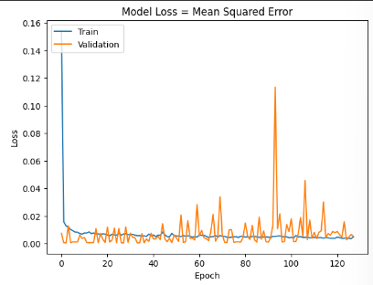
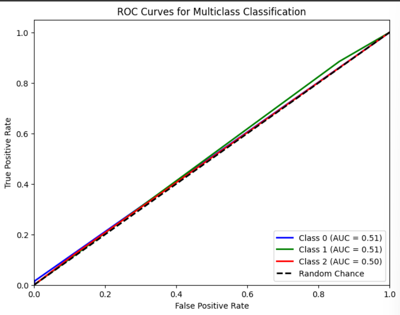
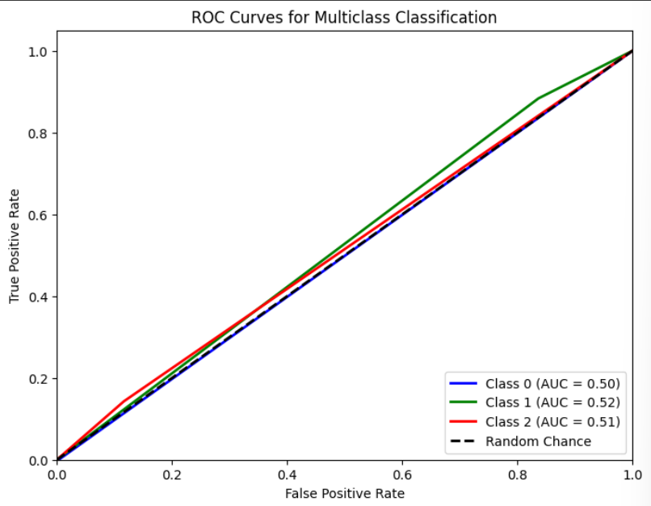
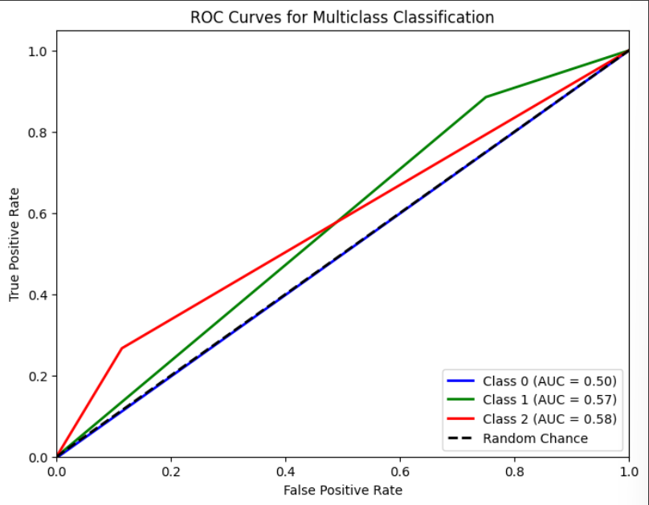

# Single Layer LSTM Regression 10

## Variáveis no modelo 

    df.Close.size: 3332
    target_df_Close.size: 3272
    target_df_Change.size: 3272
    target_df_Variation.size: 3272

    Tamanhos dos dados:
    size: 3272
    train_size: 2290
    validation_size: 327
    test_size: 655

    x_train_data.shape: (2349, 5)
    x_val_data.shape: (386, 5)
    x_test_data.shape: (714, 5)
    y_train_data.shape: (2290, 1)
    y_val_data.shape: (327, 1)
    y_test_data.shape: (655, 1)

    Formas dos DataFrames e arrays:
    df.shape: (3332, 5)
    x_train.shape: (2290, 60, 5), y_train.shape: (2290, 1)
    x_val.shape: (327, 60, 5), y_val.shape: (327, 1)
    x_test.shape: (655, 60, 5), y_test.shape: (655, 1)

## Melhor modelo RandomSearch

    Trial 100 Complete 
    Best val_loss So Far: 0.00034738596878014505
    Total elapsed time: 02h 48m 36s
    Objective(name="val_loss", direction="min")

    Trial 021 summary
    Hyperparameters:
    num_lstm_units: 64
    dropout_rate: 0.18449462219037308
    learning_rate: 0.029854451029190134
    activation: tanh
    Score: 0.00034738596878014505

## Treinamento 

    Treinado por 500 épocas com EarlyStop com paciência de 100 épocas

## Métricas de Regressão

    ----- Métricas de Regressão -----
    ------------- Train -------------
    MAE: 0.020694940839972743
    MSE: 0.0007956734524048375
    RMSE: 0.028207684279373903
    MAPE: 0.673829534372226%
    R²: 0.9981410029677174
    ---------- Validation -----------
    MAE: 0.016874525790646872
    MSE: 0.0004907431679192218
    RMSE: 0.022152723713331997
    MAPE: 0.3615794868912415%
    R²: 0.9350607626926721
    -------------- Test -------------
    MAE: 0.013476867926721613
    MSE: 0.00032774316583557826
    RMSE: 0.018103678240500694
    MAPE: 0.3066690406905102%
    R²: 0.9764540977710965

## Métricas de Classificação

    Target Class Threshold: 3
    0     408
    1    2379
    2     485
    Name: YClass, dtype: int64
    Métricas por classe:
    Precisão: [0.5        0.81076389 0.1038961 ]
    Recall: [0.01587302 0.8844697  0.125     ]
    F1-Score: [0.03076923 0.84601449 0.11347518]
    AUC Médio: [0.50709191 0.51310099 0.50412437]

    Média das métricas:
    Acurácia: 0.7267175572519083
    Precisão: 0.7267175572519083
    Recall: 0.7267175572519083
    F1-Score: 0.7267175572519083
    AUC Médio: 0.7950381679389313
==========================

    Target Class Threshold: 5
    0     208
    1    2830
    2     234
    Name: YClass, dtype: int64

    Métricas por classe:
    Precisão: [0.         0.92013889 0.05194805]
    Recall: [0.         0.88333333 0.14285714]
    F1-Score: [0.         0.90136054 0.07619048]
    AUC Médio: [0.49840764 0.52348485 0.51321486]

    Média das métricas:
    Acurácia: 0.815267175572519
    Precisão: 0.815267175572519
    Recall: 0.815267175572519
    F1-Score: 0.815267175572519
    AUC Médio: 0.8614503816793894
==========================

    Target Class Threshold: 7
    0      98
    1    3048
    2     126
    Name: YClass, dtype: int64

    Métricas por classe:
    Precisão: [0.         0.96354167 0.05194805]
    Recall: [0.         0.88516746 0.26666667]
    F1-Score: [0.         0.92269327 0.08695652]
    AUC Médio: [0.49844237 0.56758373 0.57630208]

    Média das métricas:
    Acurácia: 0.8534351145038168
    Precisão: 0.8534351145038168
    Recall: 0.8534351145038168
    F1-Score: 0.8534351145038169
    AUC Médio: 0.8900763358778626

