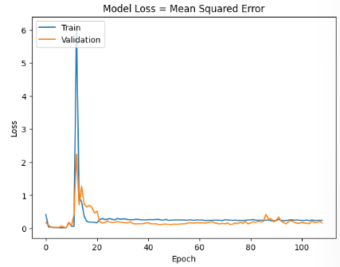
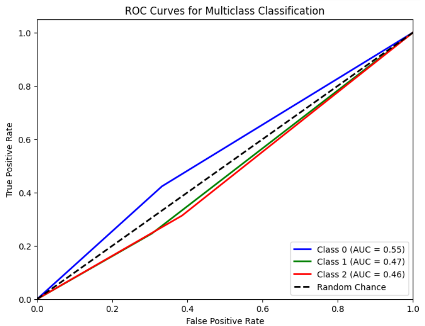
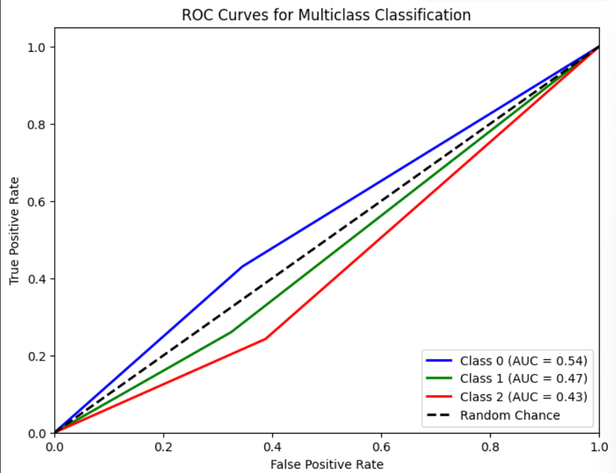

# Single Layer LSTM Regression 11

## Variáveis no modelo 

    df.Close.size: 3332
    target_df_Close.size: 3266
    target_df_Change.size: 3266
    target_df_Variation.size: 3266

    Tamanhos dos dados:
    size: 3266
    train_size: 2286
    validation_size: 326
    test_size: 654

    x_train_data.shape: (2345, 5)
    x_val_data.shape: (385, 5)
    x_test_data.shape: (713, 5)
    y_train_data.shape: (2286, 1)
    y_val_data.shape: (326, 1)
    y_test_data.shape: (654, 1)

    Formas dos DataFrames e arrays:
    df.shape: (3332, 5)
    x_train.shape: (2286, 60, 5), y_train.shape: (2286, 1)
    x_val.shape: (326, 60, 5), y_val.shape: (326, 1)
    x_test.shape: (654, 60, 5), y_test.shape: (654, 1)

## Melhor modelo RandomSearch

## Treinamento 

    Treinado por 500 épocas com EarlyStop com paciência de 100 épocas

## Métricas de Regressão

    

## Métricas de Classificação

==========================

==========================

