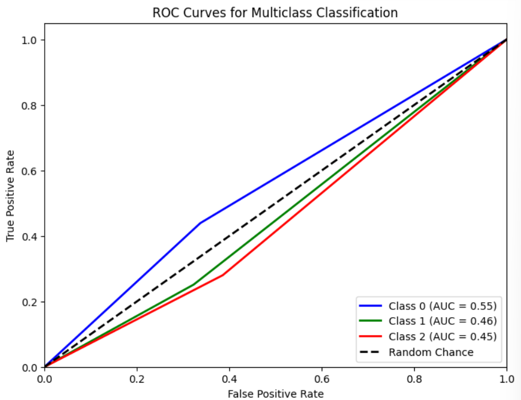

# Single Layer LSTM Regression 11

## Variáveis no modelo 

    df.Close.size: 3332
    target_df_Close.size: 3266
    target_df_Change.size: 3266
    target_df_Variation.size: 3266

    Tamanhos dos dados:
    size: 3266
    train_size: 2286
    validation_size: 326
    test_size: 654

    x_train_data.shape: (2345, 5)
    x_val_data.shape: (385, 5)
    x_test_data.shape: (713, 5)
    y_train_data.shape: (2286, 1)
    y_val_data.shape: (326, 1)
    y_test_data.shape: (654, 1)

    Formas dos DataFrames e arrays:
    df.shape: (3332, 5)
    x_train.shape: (2286, 60, 5), y_train.shape: (2286, 1)
    x_val.shape: (326, 60, 5), y_val.shape: (326, 1)
    x_test.shape: (654, 60, 5), y_test.shape: (654, 1)

## Melhor modelo RandomSearch

    Trial 100 Complete 
    Best val_loss So Far: 0.001824783394113183
    Total elapsed time: 03h 03m 46s
    Objective(name="val_loss", direction="min")

    Trial 080 summary
    Hyperparameters:
    num_lstm_units: 48
    dropout_rate: 0.25356030570167604
    learning_rate: 0.07598629268102824
    activation: tanh
    Score: 0.001824783394113183

## Treinamento 

    Treinado por 500 épocas com EarlyStop com paciência de 100 épocas

## Métricas de Regressão
    
    ------------- Train -------------
    MAE: 0.04847429178029049
    MSE: 0.0040438727051456
    RMSE: 0.06359145150997578
    MAPE: 1.5098026858908324%
    R²: 0.9905621786155179
    ---------- Validation -----------
    MAE: 0.10502081333238372
    MSE: 0.014542848182515947
    RMSE: 0.12059373193709509
    MAPE: 2.225846045810151%
    R²: -0.9196537420630464
    -------------- Test -------------
    MAE: 0.04371990298555792
    MSE: 0.0029822956220552175
    RMSE: 0.05461039847918359
    MAPE: 0.993275396122432%
    R²: 0.784954479970251

## Métricas de Classificação
Target Class Threshold: 3
0     897
1    1158
2    1211
Name: YClass, dtype: int64
Métricas por classe:
Precisão: [0.31759657 0.4010989  0.23849372]
Recall: [0.42285714 0.24579125 0.31318681]
F1-Score: [0.3627451  0.30480167 0.27078385]
AUC Médio: [0.5454578  0.47023456 0.4637968 ]

Média das métricas:
Acurácia: 0.3119266055045872
Precisão: 0.3119266055045872
Recall: 0.3119266055045872
F1-Score: 0.3119266055045872
AUC Médio: 0.4839449541284403
=====================

Target Class Threshold: 5
0     668
1    1663
2     935
Name: YClass, dtype: int64

Métricas para o THRESHOLD = 5
Métricas por classe:
Precisão: [0.23175966 0.56043956 0.14644351]
Recall: [0.43902439 0.25123153 0.28      ]
F1-Score: [0.30337079 0.34693878 0.19230769]
AUC Médio: [0.55096229 0.46432544 0.44718336]

Média das métricas:
Acurácia: 0.29204892966360857
Precisão: 0.29204892966360857
Recall: 0.29204892966360857
F1-Score: 0.29204892966360857
AUC Médio: 0.46903669724770647
=========================

Target Class Threshold: 7
0     491
1    2032
2     743
Name: YClass, dtype: int64

Métricas por classe:
Precisão: [0.15879828 0.67032967 0.10041841]
Recall: [0.43023256 0.26012793 0.24242424]
F1-Score: [0.23197492 0.37480799 0.14201183]
AUC Médio: [0.54258107 0.4679018  0.42751843]

Média das métricas:
Acurácia: 0.2798165137614679
Precisão: 0.2798165137614679
Recall: 0.2798165137614679
F1-Score: 0.2798165137614679
AUC Médio: 0.4598623853211009

==========================

