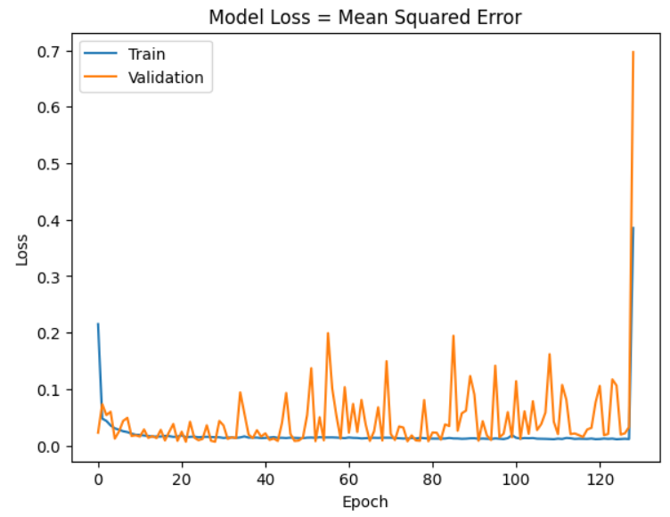
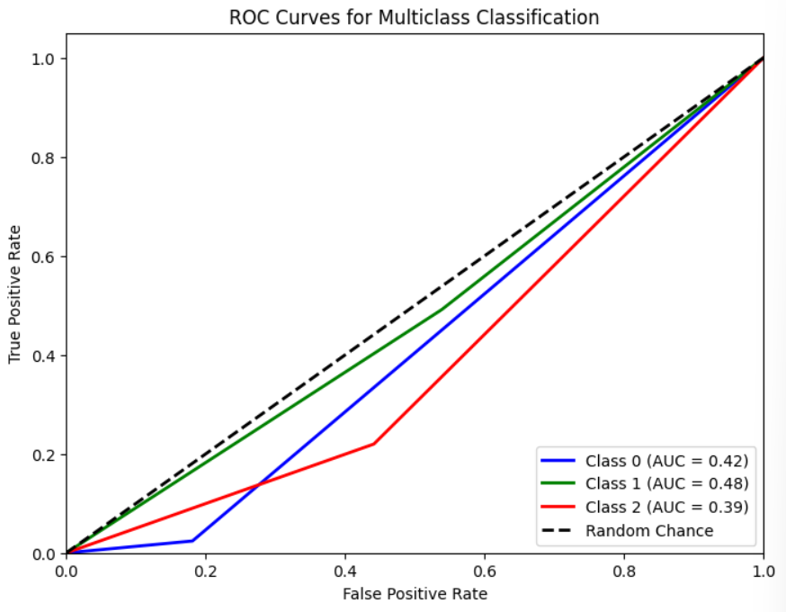
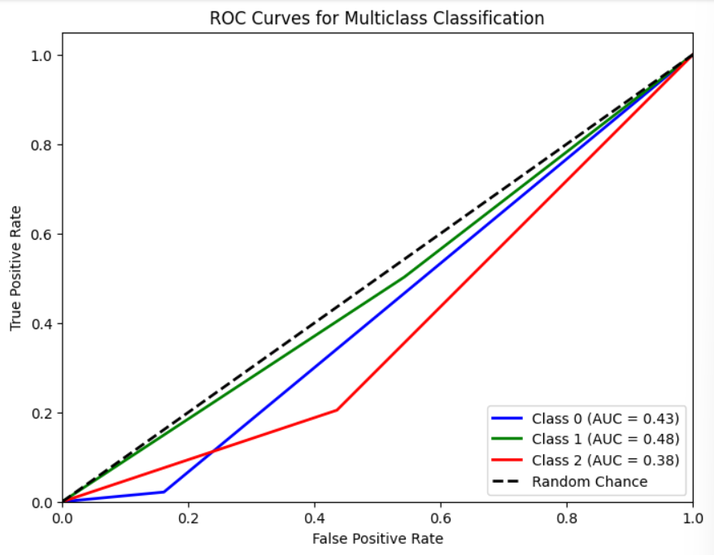
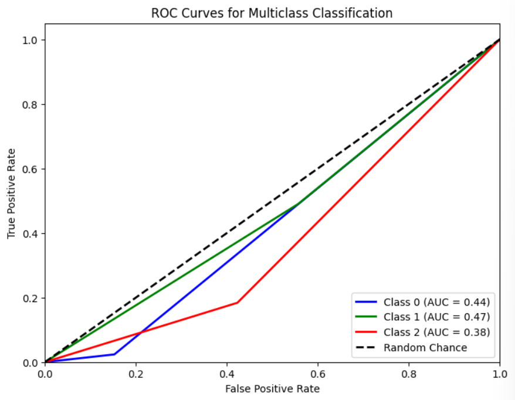

# Single Layer LSTM Regression 12

## Variáveis no modelo 

    df.Close.size: 3332
    target_df_Close.size: 3243
    target_df_Change.size: 3243
    target_df_Variation.size: 3243

    Tamanhos dos dados:
    size: 3243
    train_size: 2270
    validation_size: 324
    test_size: 649

    x_train_data.shape: (2329, 5)
    x_val_data.shape: (383, 5)
    x_test_data.shape: (708, 5)
    y_train_data.shape: (2270, 1)
    y_val_data.shape: (324, 1)
    y_test_data.shape: (649, 1)

    Formas dos DataFrames e arrays:
    df.shape: (3332, 5)
    x_train.shape: (2270, 60, 5), y_train.shape: (2270, 1)
    x_val.shape: (324, 60, 5), y_val.shape: (324, 1)
    x_test.shape: (649, 60, 5), y_test.shape: (649, 1)

## Melhor modelo RandomSearch

    Trial 100 Complete
    Best val_loss So Far: 0.006171107292175293
    Total elapsed time: 02h 54m 32s
    Objective(name="val_loss", direction="min")

    Trial 042 summary
    Hyperparameters:
    num_lstm_units: 32
    dropout_rate: 0.09553764814408688
    learning_rate: 0.04160097851397762
    activation: tanh
    Score: 0.006171107292175293

## Treinamento 

    Treinado por 500 épocas com EarlyStop com paciência de 100 épocas

## Métricas de Regressão

    ----- Métricas de Regressão -----
    ------------- Train -------------
    MAE: 0.07855440836347717
    MSE: 0.010918802623049013
    RMSE: 0.10449307452194626
    MAPE: 2.2819454670713872%
    R²: 0.9745650503663033
    ---------- Validation -----------
    MAE: 0.06940895026384718
    MSE: 0.0065885538065536915
    RMSE: 0.08116990702565632
    MAPE: 1.4845793222639585%
    R²: 0.14027833163240855
    -------------- Test -------------
    MAE: 0.064489160311398
    MSE: 0.0069520264843303935
    RMSE: 0.08337881316216005
    MAPE: 1.467107271750343%
    R²: 0.4905061189765809

## Métricas de Classificação

    Target Class Threshold: 3
    0    1183
    1     431
    2    1629
    Name: YClass, dtype: int64

    Métricas por classe:
    Precisão: [0.09722222 0.16860465 0.22746781]
    Recall: [0.02413793 0.49152542 0.21991701]
    F1-Score: [0.03867403 0.25108225 0.22362869]
    AUC Médio: [0.42153972 0.47645951 0.38937027]

    Média das métricas:
    Acurácia: 0.18181818181818182
    Precisão: 0.18181818181818182
    Recall: 0.18181818181818182
    F1-Score: 0.18181818181818182
    AUC Médio: 0.3863636363636363
==========================

    Target Class Threshold: 5
    0    1026
    1     721
    2    1496
    Name: YClass, dtype: int64

    Métricas por classe:
    Precisão: [0.06944444 0.29360465 0.1888412 ]
    Recall: [0.02145923 0.50248756 0.20465116]
    F1-Score: [0.03278689 0.3706422  0.19642857]
    AUC Médio: [0.43020077 0.48003842 0.38458365]

    Média das métricas:
    Acurácia: 0.23112480739599384
    Precisão: 0.23112480739599384
    Recall: 0.23112480739599384
    F1-Score: 0.23112480739599384
    AUC Médio: 0.42334360554699546
==========================

    Target Class Threshold: 7
    0     912
    1     990
    2    1341
    Name: YClass, dtype: int64

    Métricas para o THRESHOLD = 7
    Métricas por classe:
    Precisão: [0.06944444 0.37790698 0.13733906]
    Recall: [0.02380952 0.49056604 0.18390805]
    F1-Score: [0.03546099 0.42692939 0.15724816]
    AUC Médio: [0.43559497 0.46663719 0.38037508]

    Média das métricas:
    Acurácia: 0.2573189522342065
    Precisão: 0.2573189522342065
    Recall: 0.2573189522342065
    F1-Score: 0.2573189522342065
    AUC Médio: 0.44298921417565484
==========================

