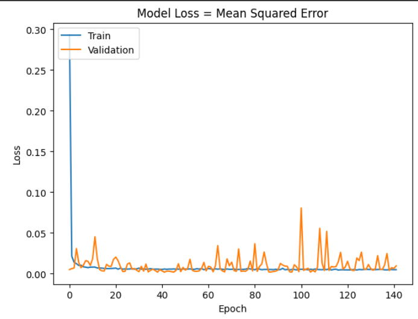
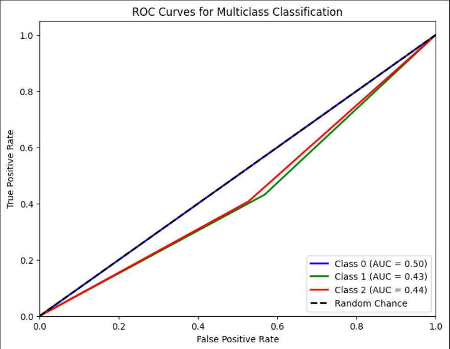
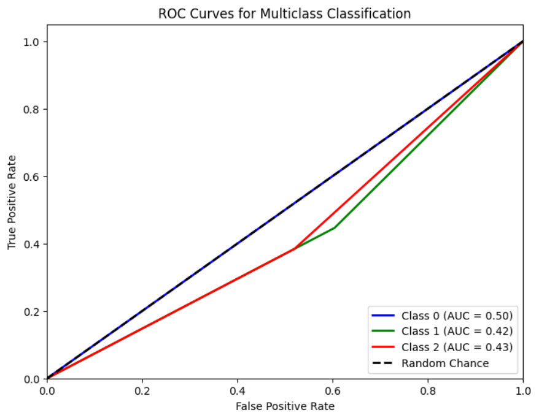
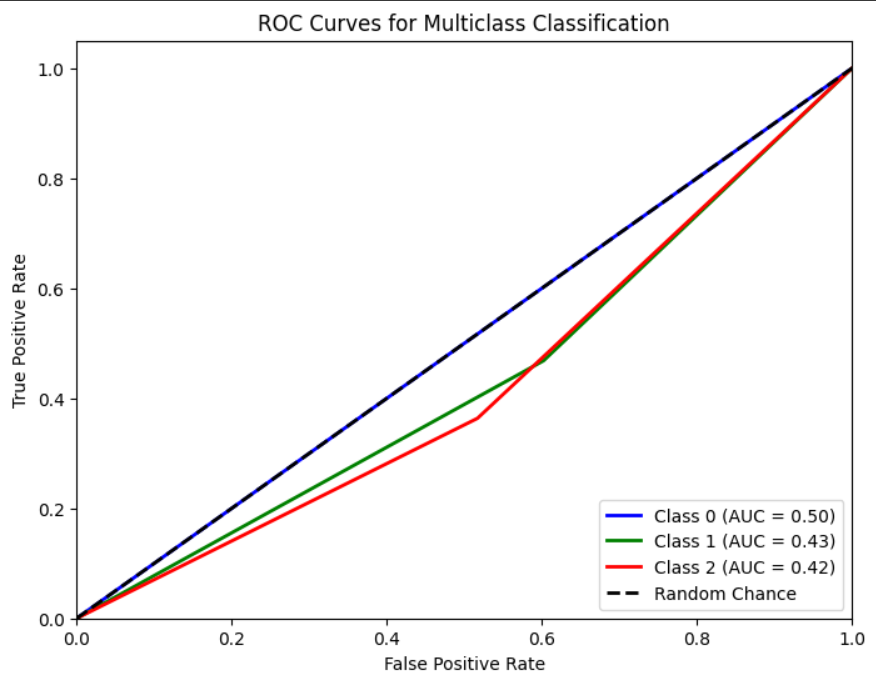

# Single Layer LSTM Regression 1

## Variáveis no modelo 

df.Close.size: 3332
target_df_Close.size: 3296
target_df_Change.size: 3296
target_df_Variation.size: 3296

Tamanhos dos dados:
size: 3296
train_size: 2307
validation_size: 329
test_size: 660

x_train_data.shape: (2336, 5)
x_val_data.shape: (358, 5)
x_test_data.shape: (689, 5)
y_train_data.shape: (2307, 1)
y_val_data.shape: (329, 1)
y_test_data.shape: (660, 1)

Formas dos DataFrames e arrays:
df.shape: (3332, 5)
x_train.shape: (2307, 30, 5), y_train.shape: (2307, 1)
x_val.shape: (329, 30, 5), y_val.shape: (329, 1)
x_test.shape: (660, 30, 5), y_test.shape: (660, 1)
## Melhor modelo RandomSearch
    Trial 100 Complete 
    Best val_loss So Far: 0.0018643309595063329
    Total elapsed time: 01h 24m 46s
    Objective(name="val_loss", direction="min")

    Trial 079 summary
    Hyperparameters:
    num_lstm_units: 48
    dropout_rate: 0.09547780498192426
    learning_rate: 0.030894741793587047
    activation: tanh
    Score: 0.0018643309595063329

## Treinamento 
    Treinado por 500 épocas com EarlyStop com paciência de 100 épocas

## Métricas de Regressão

    ------------- Train -------------
    MAE: 0.04857476588979852
    MSE: 0.003793182806851694
    RMSE: 0.061588820469722375
    MAPE: 1.5827256233393372%
    R²: 0.9911127555608641
    ---------- Validation -----------
    MAE: 0.03455052536408632
    MSE: 0.0018573967277662942
    RMSE: 0.043097525773138
    MAPE: 0.7394187600837506%
    R²: 0.7534615586719237
    -------------- Test -------------
    MAE: 0.032661659724522486
    MSE: 0.0018372471304301632
    RMSE: 0.042863120866663024
    MAPE: 0.7403331452238273%
    R²: 0.8702369931043442

## Métricas de Classificação
Target Class Threshold: 3
0     913
1    1162
2    1221
Name: YClass, dtype: int64

Métricas por classe:
Precisão: [0.         0.38622754 0.23006135]
Recall: [0.         0.43143813 0.4076087 ]
F1-Score: [0.         0.40758294 0.29411765]
AUC Médio: [0.5        0.43178555 0.44014889]

Média das métricas:
Acurácia: 0.3090909090909091
Precisão: 0.3090909090909091
Recall: 0.3090909090909091
F1-Score: 0.3090909090909091
AUC Médio: 0.4818181818181818
=================================
Target Class Threshold: 5
0     683
1    1668
2     945
Name: YClass, dtype: int64
Métricas por classe:
Precisão: [0.         0.54790419 0.14723926]
Recall: [0.         0.44634146 0.384     ]
F1-Score: [0.         0.49193548 0.21286031]
AUC Médio: [0.5        0.42117073 0.43218692]

Média das métricas:
Acurácia: 0.35
Precisão: 0.35
Recall: 0.35
F1-Score: 0.35
AUC Médio: 0.5125000000000001
=================================
Target Class Threshold: 7
0     502
1    2044
2     750
Name: YClass, dtype: int64

Métricas por classe:
Precisão: [0.         0.66467066 0.11042945]
Recall: [0.         0.46835443 0.36363636]
F1-Score: [0.         0.54950495 0.16941176]
AUC Médio: [0.5        0.43310195 0.42335116]

Média das métricas:
Acurácia: 0.39090909090909093
Precisão: 0.39090909090909093
Recall: 0.39090909090909093
F1-Score: 0.39090909090909093
AUC Médio: 0.5431818181818182

