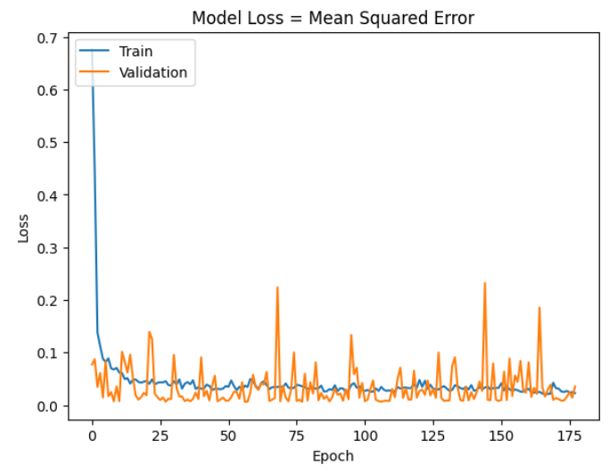
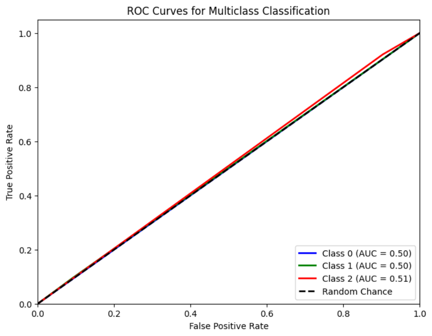
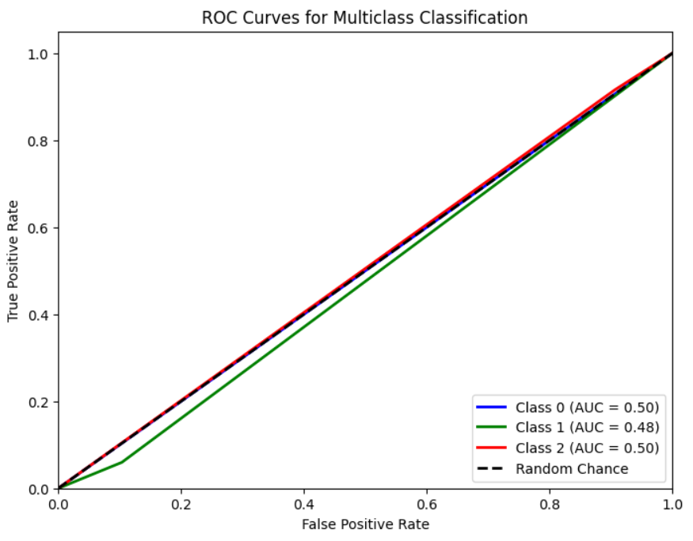
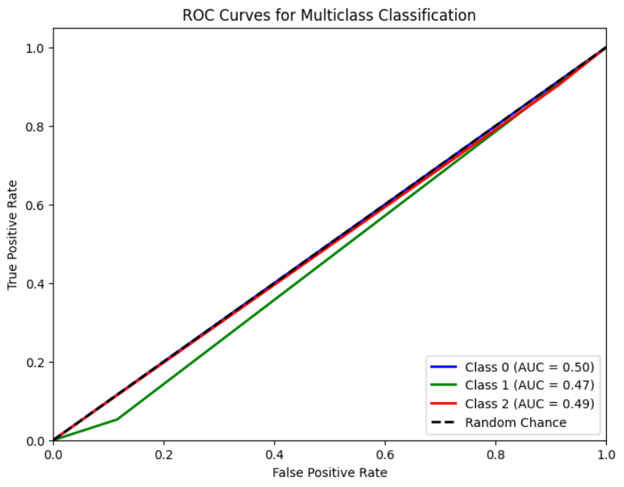

# Single Layer LSTM Regression 1

## Variáveis no modelo 

df.Close.size: 3332
target_df_Close.size: 3273
target_df_Change.size: 3273
target_df_Variation.size: 3273

Tamanhos dos dados:
size: 3273
train_size: 2291
validation_size: 327
test_size: 655

x_train_data.shape: (2320, 5)
x_val_data.shape: (356, 5)
x_test_data.shape: (684, 5)
y_train_data.shape: (2291, 1)
y_val_data.shape: (327, 1)
y_test_data.shape: (655, 1)

Formas dos DataFrames e arrays:
df.shape: (3332, 5)
x_train.shape: (2291, 30, 5), y_train.shape: (2291, 1)
x_val.shape: (327, 30, 5), y_val.shape: (327, 1)
x_test.shape: (655, 30, 5), y_test.shape: (655, 1)
## Melhor modelo RandomSearch
    Trial 100 Complete
    Best val_loss So Far: 0.006408374290913343
    Total elapsed time: 01h 30m 13s
    Objective(name="val_loss", direction="min")

    Trial 051 summary
    Hyperparameters:
    num_lstm_units: 96
    dropout_rate: 0.16707637167632275
    learning_rate: 0.08065320670677177
    activation: tanh
    Score: 0.006408374290913343

## Treinamento 
    Treinado por 500 épocas com EarlyStop com paciência de 100 épocas

## Métricas de Regressão

    ------------- Train -------------
    MAE: 0.07933707452766191
    MSE: 0.010991538773766624
    RMSE: 0.10484053974377766
    MAPE: 2.4392468543767714%
    R²: 0.9743260200684748
    ---------- Validation -----------
    MAE: 0.06747160655469228
    MSE: 0.0064259646373810925
    RMSE: 0.08016211472622894
    MAPE: 1.44886883044315%
    R²: 0.149662654938731
    -------------- Test -------------
    MAE: 0.09415796846848307
    MSE: 0.012997573597394558
    RMSE: 0.11400690153404994
    MAPE: 2.142236841031482%
    R²: 0.06622127006985845

## Métricas de Classificação
=========================

    Target Class Threshold: 3
    0    1192
    1     437
    2    1644
    Name: YClass, dtype: int64

    Métricas por classe:
    Precisão: [0.         0.18644068 0.37248322]
    Recall: [0.         0.09322034 0.92116183]
    F1-Score: [0.         0.12429379 0.53046595]
    AUC Médio: [0.5        0.50191743 0.50889009]

    Média das métricas:
    Acurácia: 0.35572519083969467
    Precisão: 0.35572519083969467
    Recall: 0.35572519083969467
    F1-Score: 0.35572519083969467
    AUC Médio: 0.5167938931297711

=========================

    Target Class Threshold: 5
    0    1032
    1     733
    2    1508
    Name: YClass, dtype: int64

    Métricas por classe:
    Precisão: [0.         0.20338983 0.33053691]
    Recall: [0.         0.05970149 0.91627907]
    F1-Score: [0.         0.09230769 0.48581998]
    AUC Médio: [0.5        0.47808863 0.50473044]

    Média das métricas:
    Acurácia: 0.3190839694656489
    Precisão: 0.3190839694656489
    Recall: 0.3190839694656489
    F1-Score: 0.3190839694656489
    AUC Médio: 0.48931297709923666

=========================

    Target Class Threshold: 7
    0     917
    1    1004
    2    1352

    Métricas por classe:
    Precisão: [0.         0.23728814 0.26342282]
    Recall: [0.         0.05263158 0.90229885]
    F1-Score: [0.         0.08615385 0.40779221]
    AUC Médio: [0.5        0.46847517 0.49480847]

    Média das métricas:
    Acurácia: 0.26106870229007634
    Precisão: 0.26106870229007634
    Recall: 0.26106870229007634
    F1-Score: 0.26106870229007634
    AUC Médio: 0.44580152671755724

