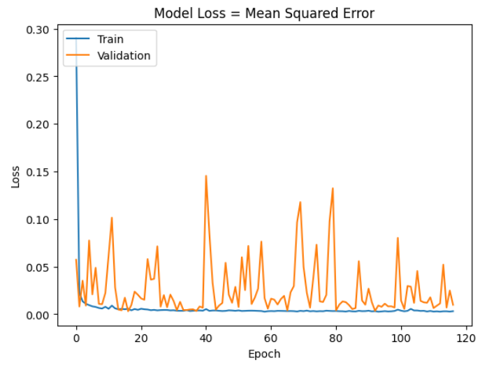
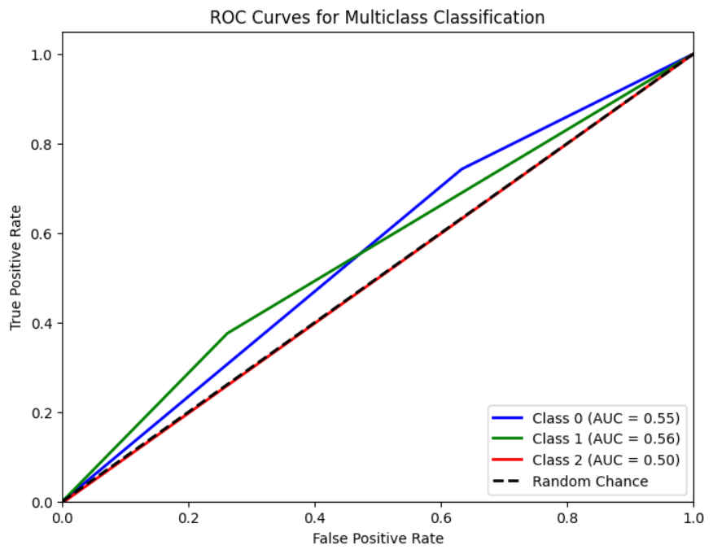
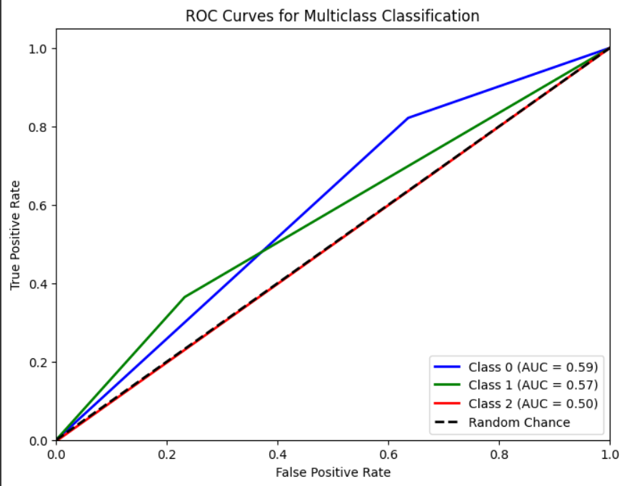
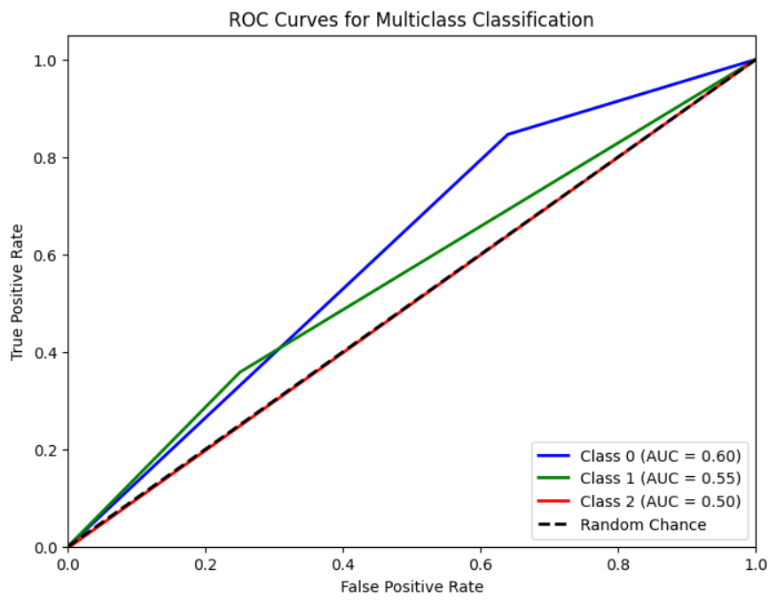

# Single Layer LSTM Regression 1

## Variáveis no modelo 

df.Close.size: 3332
target_df_Close.size: 3317
target_df_Change.size: 3317
target_df_Variation.size: 3317

Tamanhos dos dados:
size: 3317
train_size: 2321
validation_size: 331
test_size: 665

x_train_data.shape: (2335, 5)
x_val_data.shape: (345, 5)
x_test_data.shape: (679, 5)
y_train_data.shape: (2321, 1)
y_val_data.shape: (331, 1)
y_test_data.shape: (665, 1)

Formas dos DataFrames e arrays:
df.shape: (3332, 5)
x_train.shape: (2321, 15, 5), y_train.shape: (2321, 1)
x_val.shape: (331, 15, 5), y_val.shape: (331, 1)
x_test.shape: (665, 15, 5), y_test.shape: (665, 1)
## Melhor modelo RandomSearch
    Trial 100 Complete
    Best val_loss So Far: 0.00046592572471126914
    Total elapsed time: 01h 00m 08s
    Objective(name="val_loss", direction="min")

    Trial 097 summary
    Hyperparameters:
    num_lstm_units: 64
    dropout_rate: 0.15907251182387064
    learning_rate: 0.03382641228860334
    activation: tanh
    Score: 0.00046592572471126914

## Treinamento 
    Treinado por 500 épocas com EarlyStop com paciência de 100 épocas

## Métricas de Regressão

    ------------- Train -------------
    MAE: 0.04633009047464792
    MSE: 0.003640566672918962
    RMSE: 0.06033710858931642
    MAPE: 1.6164405325385507%
    R²: 0.9914371895206917
    ---------- Validation -----------
    MAE: 0.04252699807764246
    MSE: 0.0031526209076457572
    RMSE: 0.05614820484793576
    MAPE: 0.9105616643557791%
    R²: 0.5767619550340171
    -------------- Test -------------
    MAE: 0.03397574370576603
    MSE: 0.0017669927951921031
    RMSE: 0.042035613415199534
    MAPE: 0.7694957076891006%
    R²: 0.8770745863579215

## Métricas de Classificação
=========================

    Target Class Threshold: 3
    0     417
    1    2409
    2     491
    Name: YClass, dtype: int64

    Métricas por classe:
    Precisão: [0.11448598 0.85531915 0.        ]
    Recall: [0.74242424 0.37570093 0.        ]
    F1-Score: [0.19838057 0.52207792 0.        ]
    AUC Médio: [0.55485152 0.55708124 0.49833611]

    Média das métricas:
    Acurácia: 0.37593984962406013
    Precisão: 0.37593984962406013
    Recall: 0.37593984962406013
    F1-Score: 0.37593984962406013
    AUC Médio: 0.5319548872180452
=========================

    Target Class Threshold: 5
    0     213
    1    2868
    2     236
    Name: YClass, dtype: int64

    Precisão: [0.05373832 0.94468085 0.        ]
    Recall: [0.82142857 0.36453202 0.        ]
    F1-Score: [0.10087719 0.52606635 0.        ]
    AUC Médio: [0.5928179  0.56619458 0.49843014]

    Média das métricas:
    Acurácia: 0.3684210526315789
    Precisão: 0.3684210526315789
    Recall: 0.3684210526315789
    F1-Score: 0.3684210526315789
    AUC Médio: 0.5263157894736842
=========================

    Target Class Threshold: 7
    0      99
    1    3091
    2     127
    Name: YClass, dtype: int64

    Métricas por classe:
    Precisão: [0.02570093 0.97021277 0.        ]
    Recall: [0.84615385 0.35792779 0.        ]
    F1-Score: [0.04988662 0.52293578 0.        ]
    AUC Médio: [0.60329165 0.55396389 0.49846154]

    Média das métricas:
    Acurácia: 0.3593984962406015
    Precisão: 0.3593984962406015
    Recall: 0.3593984962406015
    F1-Score: 0.3593984962406015
    AUC Médio: 0.5195488721804512

