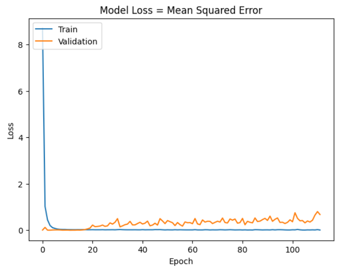
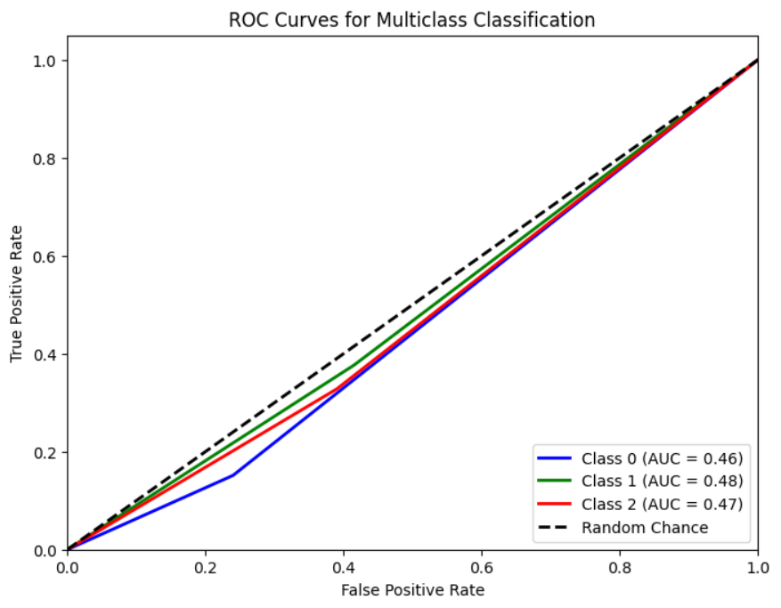
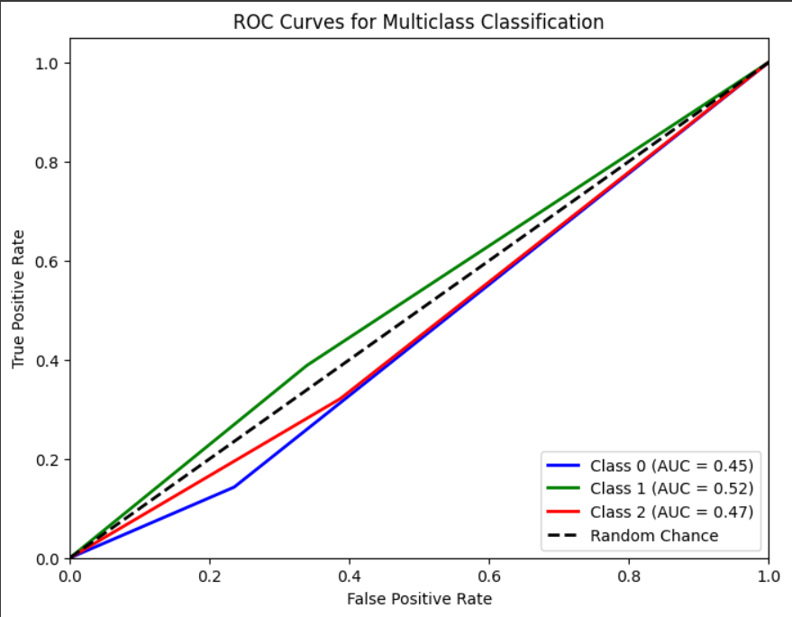
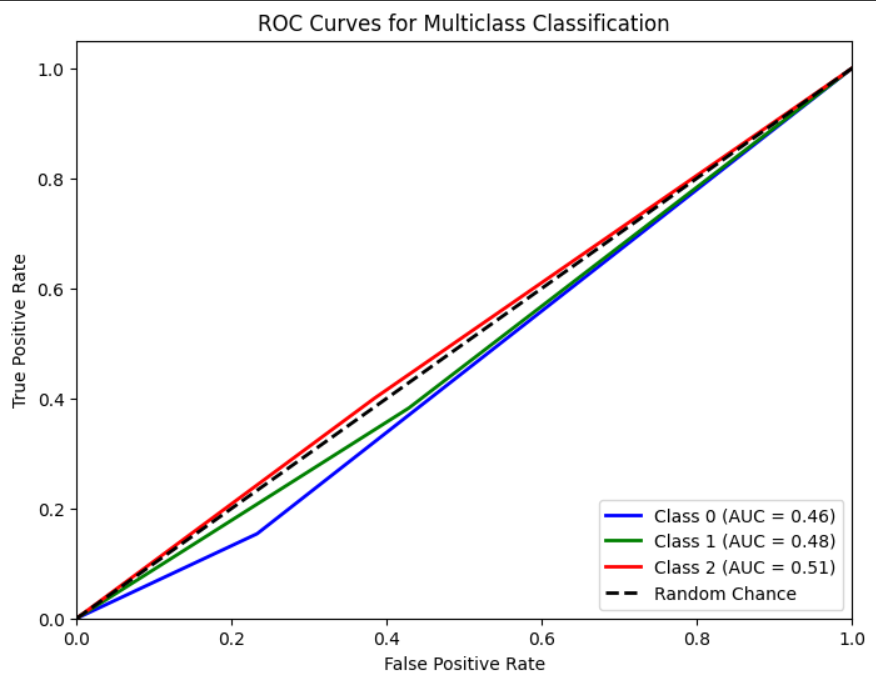

# Single Layer LSTM Regression 1

## Variáveis no modelo 
    df.Close.size: 3332
    target_df_Close.size: 3325
    target_df_Change.size: 3325
    target_df_Variation.size: 3325

    Tamanhos dos dados:
    size: 3325
    train_size: 2327
    validation_size: 332
    test_size: 666

    x_train_data.shape: (2333, 5)
    x_val_data.shape: (338, 5)
    x_test_data.shape: (672, 5)
    y_train_data.shape: (2327, 1)
    y_val_data.shape: (332, 1)
    y_test_data.shape: (666, 1)

    Formas dos DataFrames e arrays:
    df.shape: (3332, 5)
    x_train.shape: (2327, 7, 5), y_train.shape: (2327, 1)
    x_val.shape: (332, 7, 5), y_val.shape: (332, 1)
    x_test.shape: (666, 7, 5), y_test.shape: (666, 1)

## Melhor modelo RandomSearch
    Trial 100 Complete
    Best val_loss So Far: 0.0004099243087694049
    Total elapsed time: 00h 52m 02s
    Objective(name="val_loss", direction="min")

    Trial 057 summary
    Hyperparameters:
    num_lstm_units: 96
    dropout_rate: 0.062078552244107944
    learning_rate: 0.06404687722635315
    activation: tanh
    Score: 0.0004099243087694049

## Treinamento 
    Treinado por 500 épocas com EarlyStop com paciência de 100 épocas

## Métricas de Regressão
    ------------- Train -------------
    MAE: 0.057996010916621696
    MSE: 0.004938309454716843
    RMSE: 0.07027310619801037
    MAPE: 1.7483565736292332%
    R²: 0.9883761932948592
    ---------- Validation -----------
    MAE: 0.04123302786235219
    MSE: 0.0028232393862702453
    RMSE: 0.053134164021561923
    MAPE: 0.8806408864297233%
    R²: 0.6221706185770253
    -------------- Test -------------
    MAE: 0.0343646000084793
    MSE: 0.001977187197750205
    RMSE: 0.04446557317465058
    MAPE: 0.7773721841422337%
    R²: 0.8630743226633985

## Métricas de Classificação
=========================

    Target Class Threshold: 3
    0     418
    1    2415
    2     492
    Name: YClass, dtype: int64
    Métricas por classe:
    Precisão: [0.06493506 0.7890625  0.08203125]
    Recall: [0.15151515 0.37686567 0.328125  ]
    F1-Score: [0.09090909 0.51010101 0.13125   ]
    AUC Médio: [0.45575758 0.48074053 0.46887978]

    Média das métricas:
    Acurácia: 0.34984984984984985
    Precisão: 0.34984984984984985
    Recall: 0.34984984984984985
    F1-Score: 0.34984984984984985
    AUC Médio: 0.5123873873873874
=========================

    Target Class Threshold: 5
    0     214
    1    2875
    2     236
    Name: YClass, dtype: int64

    Métricas por classe:
    Precisão: [0.02597403 0.92578125 0.03515625]
    Recall: [0.14285714 0.38852459 0.32142857]
    F1-Score: [0.04395604 0.54734411 0.06338028]
    AUC Médio: [0.45387371 0.52461944 0.46714062]

    Média das métricas:
    Acurácia: 0.37537537537537535
    Precisão: 0.37537537537537535
    Recall: 0.37537537537537535
    F1-Score: 0.37537537537537535
    AUC Médio: 0.5315315315315314
=========================

    Target Class Threshold: 7
    0      99
    1    3099
    2     127
    Name: YClass, dtype: int64

    Métricas por classe:
    Precisão: [0.01298701 0.953125   0.0234375 ]
    Recall: [0.15384615 0.38244514 0.4       ]
    F1-Score: [0.0239521  0.5458613  0.04428044]
    AUC Médio: [0.46053717 0.47693686 0.50798771]

    Média das métricas:
    Acurácia: 0.3783783783783784
    Precisão: 0.3783783783783784
    Recall: 0.3783783783783784
    F1-Score: 0.37837837837837834
    AUC Médio: 0.5337837837837839

