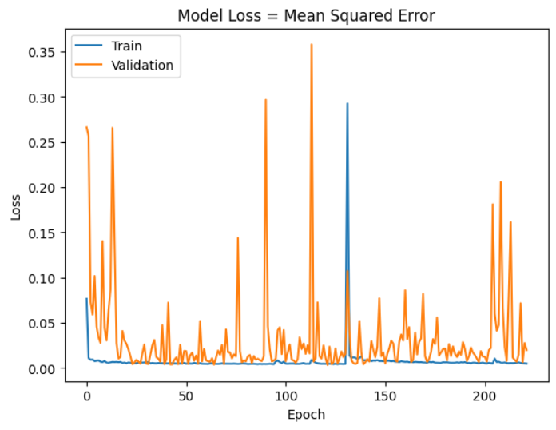
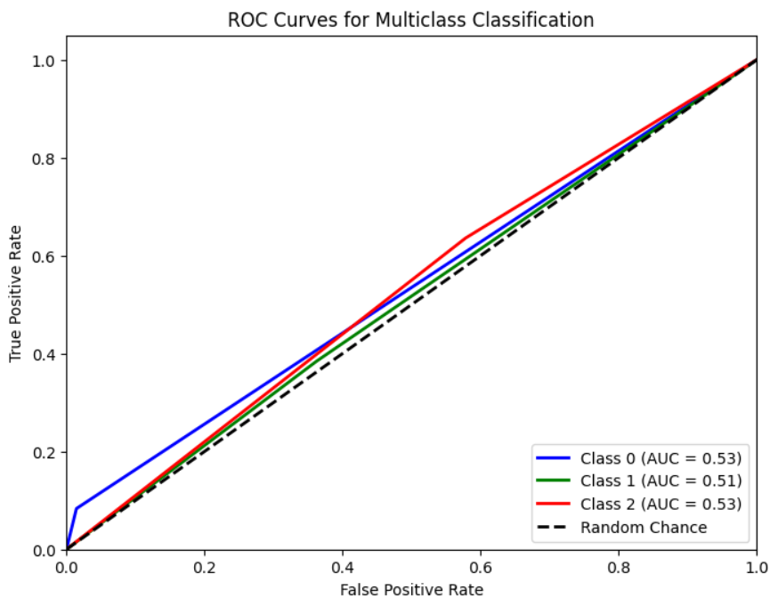
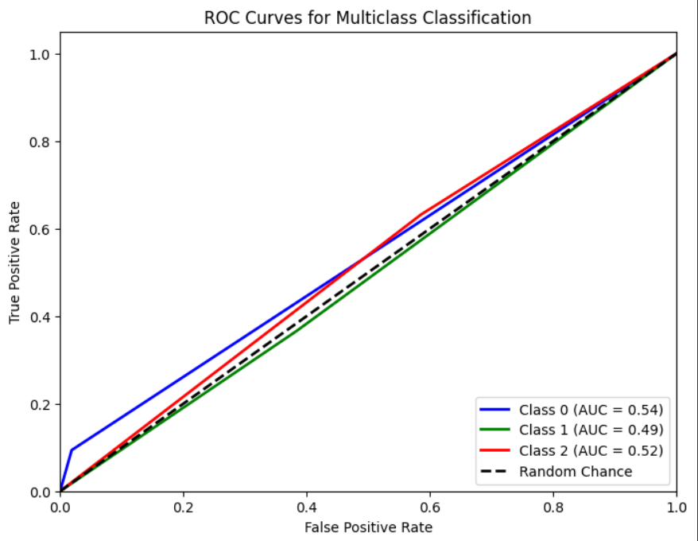
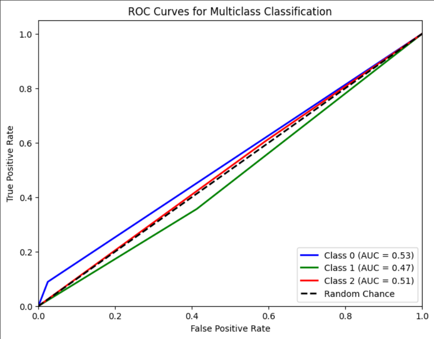

# Single Layer LSTM Regression 1

## Variáveis no modelo 
    df.Close.size: 3332
    target_df_Close.size: 3311
    target_df_Change.size: 3311
    target_df_Variation.size: 3311

    Tamanhos dos dados:
    size: 3311
    train_size: 2317
    validation_size: 331
    test_size: 663

    x_train_data.shape: (2331, 5)
    x_val_data.shape: (345, 5)
    x_test_data.shape: (677, 5)
    y_train_data.shape: (2317, 1)
    y_val_data.shape: (331, 1)
    y_test_data.shape: (663, 1)

    Formas dos DataFrames e arrays:
    df.shape: (3332, 5)
    x_train.shape: (2317, 15, 5), y_train.shape: (2317, 1)
    x_val.shape: (331, 15, 5), y_val.shape: (331, 1)
    x_test.shape: (663, 15, 5), y_test.shape: (663, 1)

## Melhor modelo RandomSearch
    Trial 100 Complete 
    Best val_loss So Far: 0.0019497424364089966
    Total elapsed time: 00h 58m 06s
    Objective(name="val_loss", direction="min")

    Trial 042 summary
    Hyperparameters:
    num_lstm_units: 48
    dropout_rate: 0.10789673307899328
    learning_rate: 0.04053785948716978
    activation: tanh
    Score: 0.0019497424364089966

## Treinamento 
    Treinado por 500 épocas com EarlyStop com paciência de 100 épocas

## Métricas de Regressão
    ------------- Train -------------
    MAE: 0.03617687165717643
    MSE: 0.002374146010537692
    RMSE: 0.04872520918926559
    MAPE: 1.0703546542925841%
    R²: 0.994420336975585
    ---------- Validation -----------
    MAE: 0.04789502660116435
    MSE: 0.0032574390464825
    RMSE: 0.057073978716070776
    MAPE: 1.0215603322072868%
    R²: 0.5632795419859249
    -------------- Test -------------
    MAE: 0.041132815514877394
    MSE: 0.002867540509207087
    RMSE: 0.05354942118461307
    MAPE: 0.9387677210345108%
    R²: 0.7991428082494068

## Métricas de Classificação
=========================

    Target Class Threshold: 3
    0     915
    1    1167
    2    1229
    Name: YClass, dtype: int64

    Métricas por classe:
    Precisão: [0.68181818 0.46558704 0.29695431]
    Recall: [0.08333333 0.38461538 0.63586957]
    F1-Score: [0.14851485 0.42124542 0.40484429]
    AUC Médio: [0.53442029 0.51098901 0.52879073]

    Média das métricas:
    Acurácia: 0.37254901960784315
    Precisão: 0.37254901960784315
    Recall: 0.37254901960784315
    F1-Score: 0.37254901960784315
    AUC Médio: 0.5294117647058824

==========================

    Target Class Threshold: 5
    0     684
    1    1675
    2     952
    Name: YClass, dtype: int64

    Métricas por classe:
    Precisão: [0.54545455 0.60728745 0.20050761]
    Recall: [0.09375    0.36585366 0.632     ]
    F1-Score: [0.16      0.456621  0.3044316]
    AUC Médio: [0.53752921 0.49122722 0.52324907]

    Média das métricas:
    Acurácia: 0.363499245852187
    Precisão: 0.363499245852187
    Recall: 0.363499245852187
    F1-Score: 0.36349924585218696
    AUC Médio: 0.5226244343891403

============================

    Target Class Threshold: 7
    0     503
    1    2052
    2     756
    Name: YClass, dtype: int64
    
    Métricas por classe:
    Precisão: [0.36363636 0.68421053 0.15228426]
    Recall: [0.08888889 0.35654008 0.60606061]
    F1-Score: [0.14285714 0.46879334 0.24340771]
    AUC Médio: [0.53222804 0.47192084 0.50693101]

    Média das métricas:
    Acurácia: 0.3574660633484163
    Precisão: 0.3574660633484163
    Recall: 0.3574660633484163
    F1-Score: 0.35746606334841635
    AUC Médio: 0.5180995475113123

    
=========================

