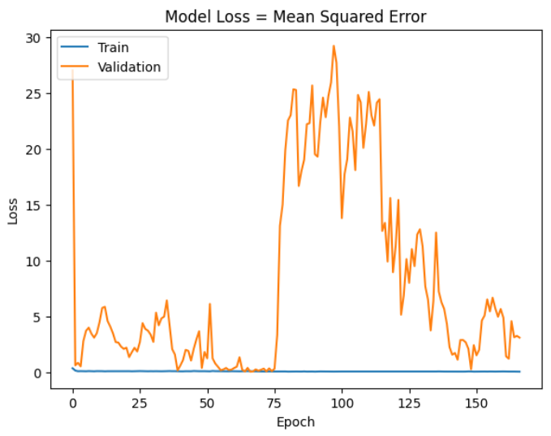
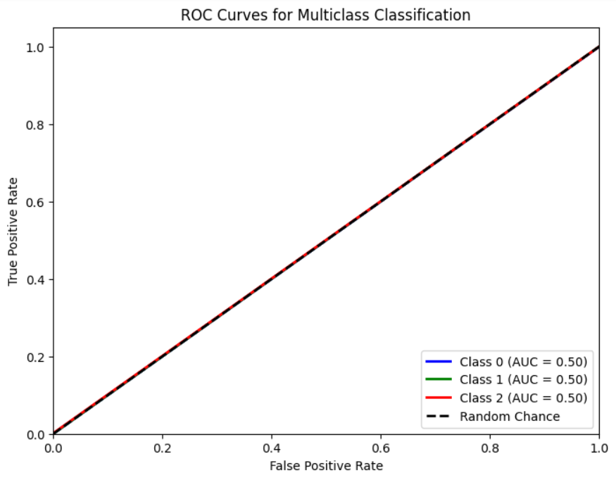
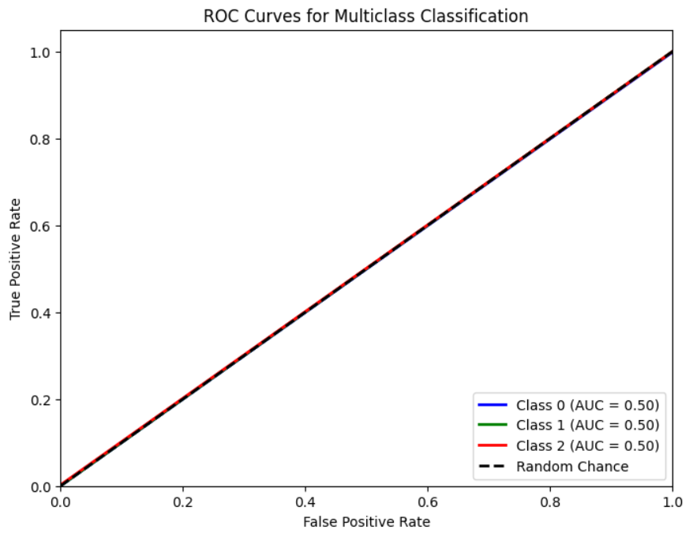
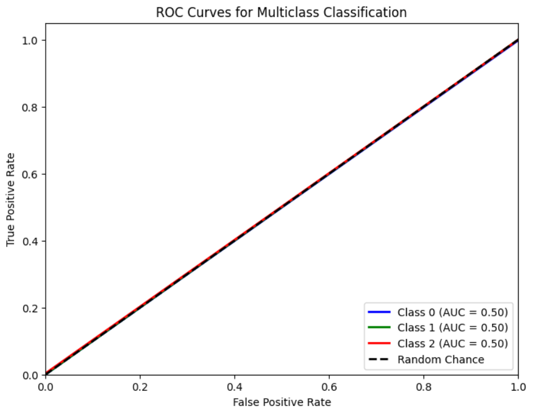

# Single Layer LSTM Regression 1

## Variáveis no modelo 

    df.Close.size: 3332
    target_df_Close.size: 3288
    target_df_Change.size: 3288
    target_df_Variation.size: 3288

    Tamanhos dos dados:
    size: 3288
    train_size: 2301
    validation_size: 328
    test_size: 659

    x_train_data.shape: (2315, 5)
    x_val_data.shape: (342, 5)
    x_test_data.shape: (673, 5)
    y_train_data.shape: (2301, 1)
    y_val_data.shape: (328, 1)
    y_test_data.shape: (659, 1)

    Formas dos DataFrames e arrays:
    df.shape: (3332, 5)
    x_train.shape: (2301, 15, 5), y_train.shape: (2301, 1)
    x_val.shape: (328, 15, 5), y_val.shape: (328, 1)
    x_test.shape: (659, 15, 5), y_test.shape: (659, 1)

## Melhor modelo RandomSearch
    Trial 100 Complete
    Best val_loss So Far: 0.006104006431996822
    Total elapsed time: 01h 09m 19s
    Objective(name="val_loss", direction="min")

    Trial 006 summary
    Hyperparameters:
    num_lstm_units: 48
    dropout_rate: 0.3580912027176354
    learning_rate: 0.07588827342097074
    activation: tanh
    Score: 0.006104006431996822

## Treinamento 
    Treinado por 500 épocas com EarlyStop com paciência de 100 épocas

## Métricas de Regressão
    ------------- Train -------------
    MAE: 0.14721225755681422
    MSE: 0.03503679460848852
    RMSE: 0.18718118123488942
    MAPE: 4.9970636079037725%
    R²: 0.9179348802310106
    ---------- Validation -----------
    MAE: 0.2983657304441257
    MSE: 0.09650949161438135
    RMSE: 0.3106597682584299
    MAPE: 6.343396937759565%
    R²: -11.754358784587774
    -------------- Test -------------
    MAE: 0.1263019429334913
    MSE: 0.021133975550142986
    RMSE: 0.14537529208962224
    MAPE: 2.8300133072101383%
    R²: -0.4969549333243388

## Métricas de Classificação
=========================
    Target Class Threshold: 3
    0    1196
    1     444
    2    1648
    Name: YClass, dtype: int64
    Métricas por classe:
    Precisão: [0.45509893 0.         0.5       ]
    Recall: [0.99666667 0.         0.00414938]
    F1-Score: [0.62486938 0.         0.00823045]
    AUC Médio: [0.49972609 0.5        0.50087852]

    Média das métricas:
    Acurácia: 0.4552352048558422
    Precisão: 0.4552352048558422
    Recall: 0.4552352048558422
    F1-Score: 0.4552352048558422
    AUC Médio: 0.5914264036418815
=========================

    Target Class Threshold: 5
    0    1036
    1     743
    2    1509
    Name: YClass, dtype: int64
    Métricas por classe:
    Precisão: [0.36834094 0.         0.5       ]
    Recall: [0.99588477 0.         0.00465116]
    F1-Score: [0.53777778 0.         0.00921659]
    AUC Médio: [0.49914431 0.5        0.50119946]

    Média das métricas:
    Acurácia: 0.36874051593323215
    Precisão: 0.36874051593323215
    Recall: 0.36874051593323215
    F1-Score: 0.36874051593323215
    AUC Médio: 0.5265553869499241
=========================

    Target Class Threshold: 7
    0     920
    1    1015
    2    1353
    Name: YClass, dtype: int64
    Métricas por classe:
    Precisão: [0.33028919 0.         0.5       ]
    Recall: [0.99541284 0.         0.00574713]
    F1-Score: [0.496      0.         0.01136364]
    AUC Médio: [0.49884021 0.5        0.50184264]

    Média das métricas:
    Acurácia: 0.330804248861912
    Precisão: 0.330804248861912
    Recall: 0.330804248861912
    F1-Score: 0.330804248861912
    AUC Médio: 0.49810318664643405
=========================

