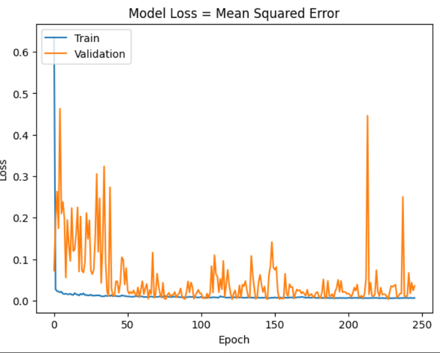
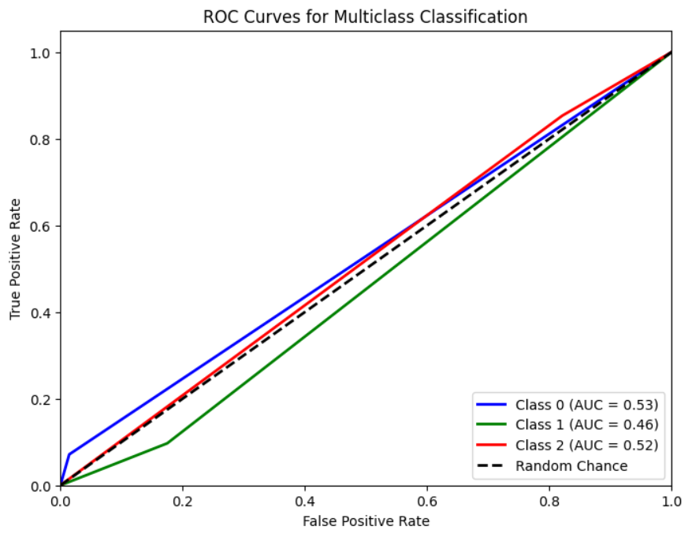
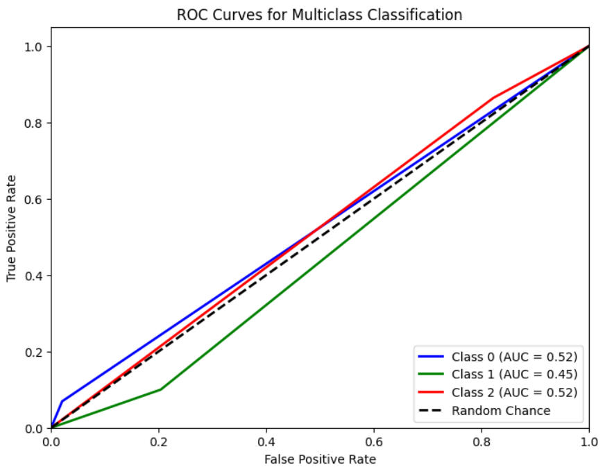

# Single Layer LSTM Regression 1

## Variáveis no modelo 
    df.Close.size: 3332
    target_df_Close.size: 3319
    target_df_Change.size: 3319
    target_df_Variation.size: 3319

    Tamanhos dos dados:
    size: 3319
    train_size: 2323
    validation_size: 331
    test_size: 665

    x_train_data.shape: (2329, 5)
    x_val_data.shape: (337, 5)
    x_test_data.shape: (671, 5)
    y_train_data.shape: (2323, 1)
    y_val_data.shape: (331, 1)
    y_test_data.shape: (665, 1)

    Formas dos DataFrames e arrays:
    df.shape: (3332, 5)
    x_train.shape: (2323, 7, 5), y_train.shape: (2323, 1)
    x_val.shape: (331, 7, 5), y_val.shape: (331, 1)
    x_test.shape: (665, 7, 5), y_test.shape: (665, 1)

## Melhor modelo RandomSearch
    Trial 100 Complete 
    Best val_loss So Far: 0.0020504863932728767
    Total elapsed time: 00h 50m 02s
    Objective(name="val_loss", direction="min")

    Trial 002 summary
    Hyperparameters:
    num_lstm_units: 80
    dropout_rate: 0.26517684616738174
    learning_rate: 0.039255186094081504
    activation: tanh
    Score: 0.0020504863932728767

## Treinamento 
    Treinado por 500 épocas com EarlyStop com paciência de 100 épocas

## Métricas de Regressão

    ------------- Train -------------
    MAE: 0.04173334280774752
    MSE: 0.0029162859696289295
    RMSE: 0.0540026478020192
    MAPE: 1.3445121272113667%
    R²: 0.9931434237327141
    ---------- Validation -----------
    MAE: 0.046774773569709355
    MSE: 0.0031717347160890403
    RMSE: 0.05631815618509754
    MAPE: 0.9976289448683096%
    R²: 0.5741959342042464
    -------------- Test -------------
    MAE: 0.05065491934947824
    MSE: 0.0037073191443046686
    RMSE: 0.0608877585751411
    MAPE: 1.1524130515674962%
    R²: 0.7420907767383946

## Métricas de Classificação
=========================

    Target Class Threshold: 3
    0     923
    1    1167
    2    1229
    Name: YClass, dtype: int64
    Métricas por classe:
    Precisão: [0.65       0.31182796 0.28442029]
    Recall: [0.07142857 0.09698997 0.85326087]
    F1-Score: [0.12871287 0.14795918 0.42663043]
    AUC Médio: [0.52846791 0.46106329 0.51602752]

    Média das métricas:
    Acurácia: 0.2992481203007519
    Precisão: 0.2992481203007519
    Recall: 0.2992481203007519
    F1-Score: 0.2992481203007519
    AUC Médio: 0.474436090225564
=========================

    Target Class Threshold: 5
    0     692
    1    1675
    2     952
    Name: YClass, dtype: int64
    Métricas por classe:
    Precisão: [0.45       0.44086022 0.19565217]
    Recall: [0.06923077 0.1        0.864     ]
    F1-Score: [0.12       0.16302187 0.31905465]
    AUC Médio: [0.52433501 0.44803922 0.52088889]

    Média das métricas:
    Acurácia: 0.23759398496240602
    Precisão: 0.23759398496240602
    Recall: 0.23759398496240602
    F1-Score: 0.23759398496240602
    AUC Médio: 0.4281954887218045
=========================

    Target Class Threshold: 7
    0     511
    1    2052
    2     756
    Name: YClass, dtype: int64
    Métricas por classe:
    Precisão: [0.35       0.56989247 0.15217391]
    Recall: [0.07692308 0.11157895 0.84848485]
    F1-Score: [0.12612613 0.18661972 0.25806452]
    AUC Médio: [0.5271375  0.45052632 0.51081486]

    Média das métricas:
    Acurácia: 0.21654135338345865
    Precisão: 0.21654135338345865
    Recall: 0.21654135338345865
    F1-Score: 0.21654135338345865
    AUC Médio: 0.412406015037594
=========================

