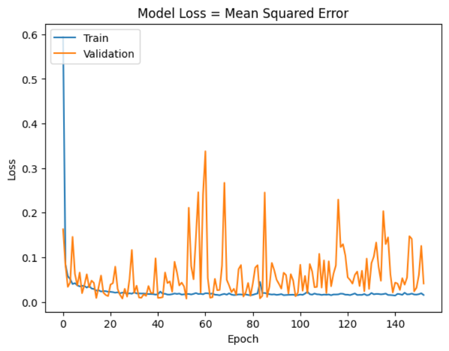
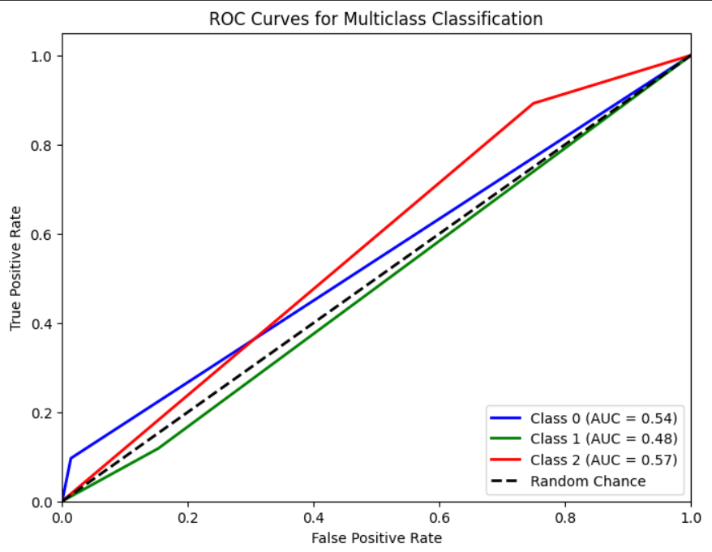
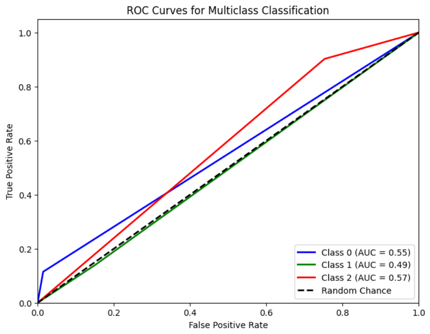
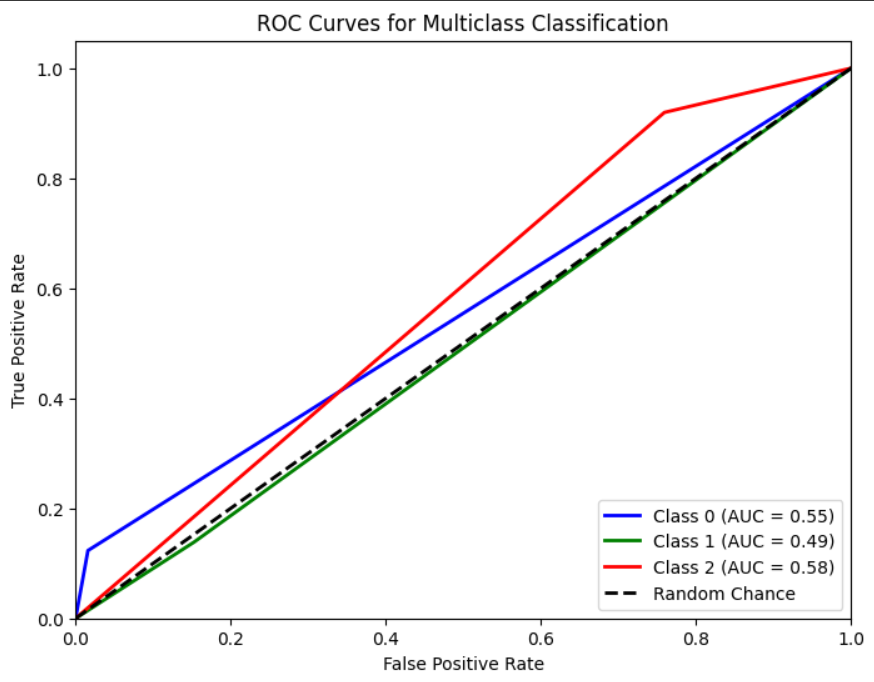

# Single Layer LSTM Regression 9

## Variáveis no modelo 

    df.Close.size: 3332
    target_df_Close.size: 3296
    target_df_Change.size: 3296
    target_df_Variation.size: 3296

    Tamanhos dos dados:
    size: 3296
    train_size: 2307
    validation_size: 329
    test_size: 660

    x_train_data.shape: (2313, 5)
    x_val_data.shape: (335, 5)
    x_test_data.shape: (666, 5)
    y_train_data.shape: (2307, 1)
    y_val_data.shape: (329, 1)
    y_test_data.shape: (660, 1)

    Formas dos DataFrames e arrays:
    df.shape: (3332, 5)
    x_train.shape: (2307, 7, 5), y_train.shape: (2307, 1)
    x_val.shape: (329, 7, 5), y_val.shape: (329, 1)
    x_test.shape: (660, 7, 5), y_test.shape: (660, 1)

## Melhor modelo RandomSearch

    Trial 100 Complete
    Best val_loss So Far: 0.006531471386551857
    Total elapsed time: 00h 56m 19s
    Objective(name="val_loss", direction="min")

    Trial 062 summary
    Hyperparameters:
    num_lstm_units: 48
    dropout_rate: 0.2203676514301789
    learning_rate: 0.07573740073903526
    activation: tanh
    Score: 0.006531471386551857

## Treinamento 

    Treinado por 500 épocas com EarlyStop com paciência de 100 épocas

## Métricas de Regressão
    ------------- Train -------------
    MAE: 0.07655119718668545
    MSE: 0.010339880742127414
    RMSE: 0.10168520414557575
    MAPE: 2.2925001258525057%
    R²: 0.9757741579285839
    ---------- Validation -----------
    MAE: 0.08073933810224941
    MSE: 0.00905810064941474
    RMSE: 0.09517405449708834
    MAPE: 1.7224088182564867%
    R²: -0.2023118066893319
    -------------- Test -------------
    MAE: 0.0684951998713113
    MSE: 0.0074745942899443005
    RMSE: 0.08645573601528299
    MAPE: 1.5627647565246383%
    R²: 0.47207655719066055

## Métricas de Classificação

    Target Class Threshold: 3
    0    1204
    1     444
    2    1648
    Name: YClass, dtype: int64
    Métricas por classe:
    Precisão: [0.85294118 0.1443299  0.40642722]
    Recall: [0.09634551 0.11864407 0.89211618]
    F1-Score: [0.17313433 0.13023256 0.55844156]
    AUC Médio: [0.54120897 0.48275377 0.57135642]

    Média das métricas:
    Acurácia: 0.39090909090909093
    Precisão: 0.39090909090909093
    Recall: 0.39090909090909093
    F1-Score: 0.39090909090909093
    AUC Médio: 0.5431818181818182

=========================

    Target Class Threshold: 5
    0    1044
    1     743
    2    1509
    Name: YClass, dtype: int64
    Métricas por classe:
    Precisão: [0.82352941 0.28865979 0.36672968]
    Recall: [0.1147541  0.13930348 0.90232558]
    F1-Score: [0.20143885 0.18791946 0.52150538]
    AUC Médio: [0.55016551 0.49448834 0.5747583 ]

    Média das métricas:
    Acurácia: 0.3787878787878788
    Precisão: 0.3787878787878788
    Recall: 0.3787878787878788
    F1-Score: 0.3787878787878788
    AUC Médio: 0.5340909090909092
=========================

    Target Class Threshold: 7
    0     927
    1    1016
    2    1353
    Name: YClass, dtype: int64
    Métricas por classe:
    Precisão: [0.79411765 0.3814433  0.30245747]
    Recall: [0.12328767 0.13857678 0.91954023]
    F1-Score: [0.21343874 0.2032967  0.45519203]
    AUC Médio: [0.55370733 0.49295251 0.58014049]

    Média das métricas:
    Acurácia: 0.3393939393939394
    Precisão: 0.3393939393939394
    Recall: 0.3393939393939394
    F1-Score: 0.3393939393939394
    AUC Médio: 0.5045454545454545

